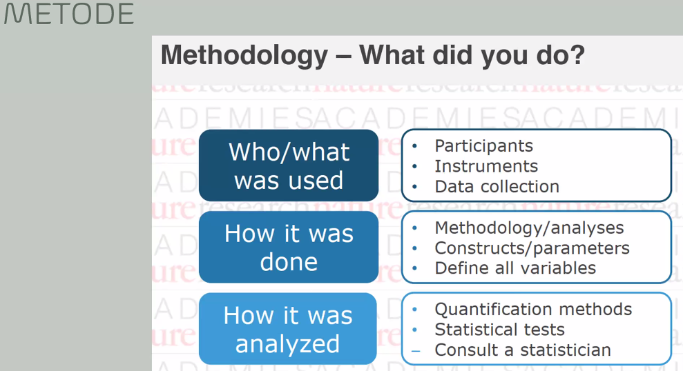

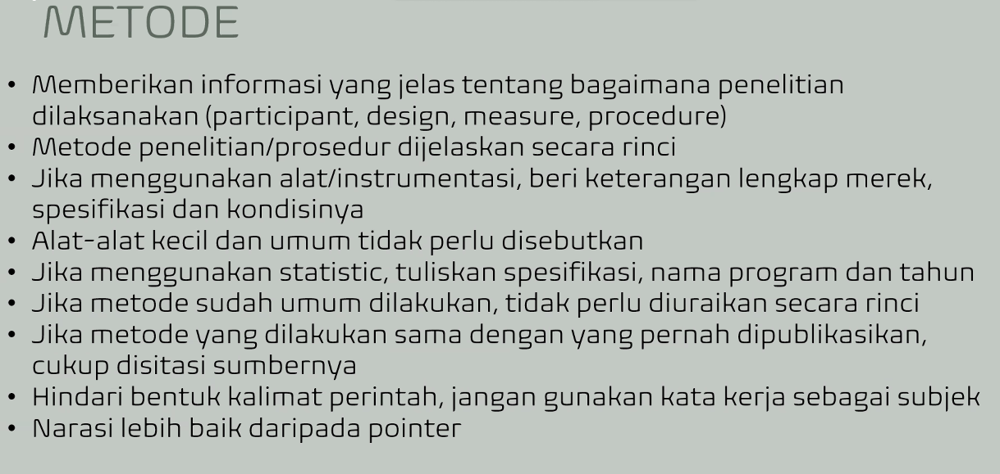

jika metodenya udah umum tidak perlu terlalu rinci. hindari menggunakan kalimat aktif (kalimat perintah) atau jika dalam bahasa inggris bentuk pas tense. jangan berikan nomor dalam metode itu, tetapi buatlah paragraf. 

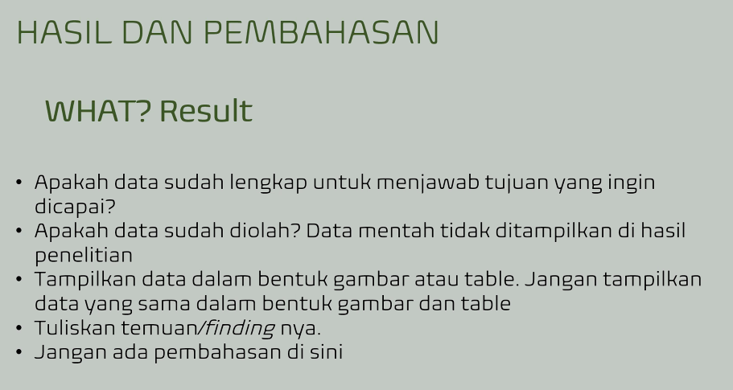

data mentah tidak boleh dikasih di artikel. nanti bisa bisa kepanjangan nanti. 

ada jurnal yang memisah antara tujuan dan pembahasan, ada juga yang digabung. 

kita punya journal yang sudah nasional sinta 4

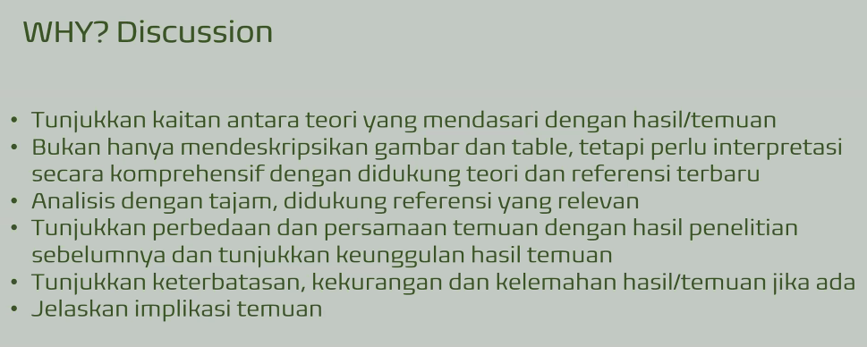

masuk kategori aktif, tidak aktif, sangat aktif. itu didasarkan dari pustaka. didukung oleh referensi. atau bisa dibandingkan penelitian lain yang sejenis. misalnya kulit melinjo lebih efektif menghambat aureus daripada daun jambu (tunjukkan referensi) darimana kita menyimpulkan seperti itu. misalnya dari diameter dari melinjo itu lebih besar.

kalau hasilnmu tidak lebih bagus, anda berikan kelebihan kekurangn keterbatasan. kemudian dituliskan di saran. 

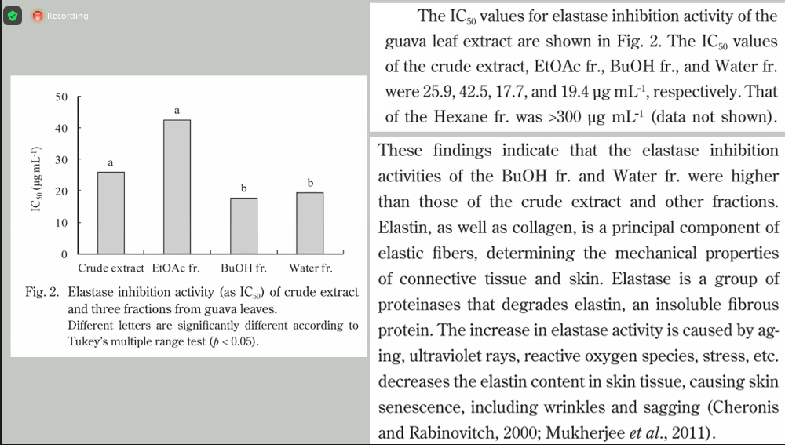

diatas adalah contoh. 

table nya itu dibahas, seperti ilustrasi dibawah ini

jika hasilnya tidak ketemu, maka dibahas saja, tetapi dengan dasar yang benar, dan carilah penyebabnya. 

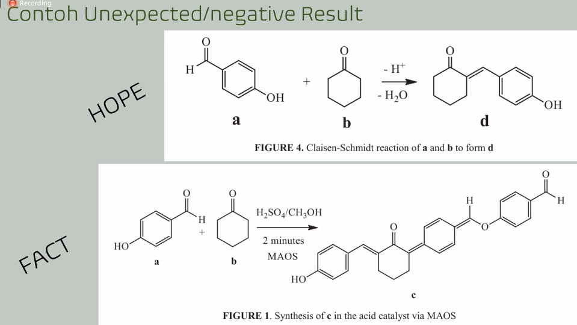

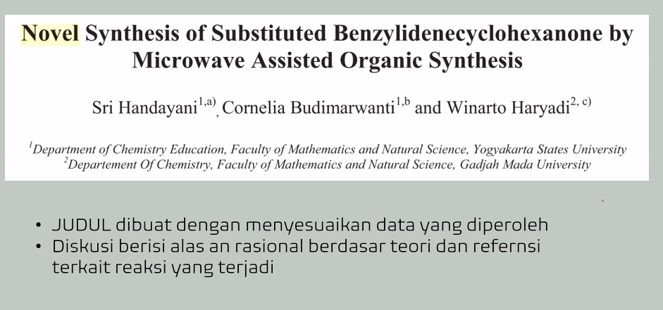

jadi ketemu by accident

alasanya harus rasional. bagaimana reaktan itu bisa menjadi seperti itu maka dijelaskan. 

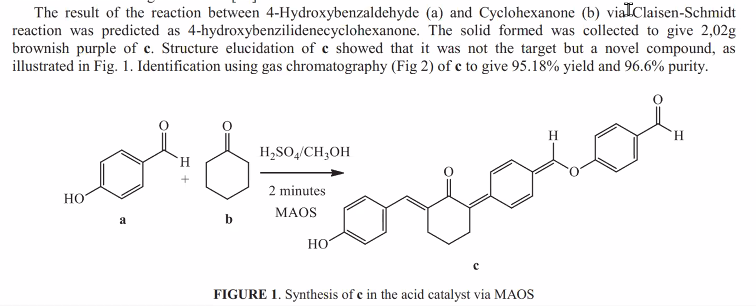

tidak menghasillan ini tidak seperti teori

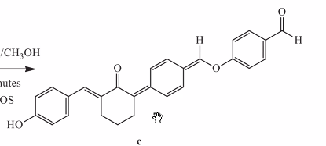

diatas adalah dibaca dari NMR

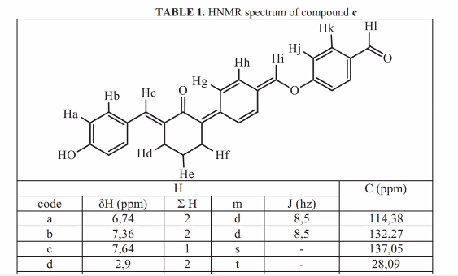

jadi anda perlu membuat mekanisme reaksi. harusnya seperti ini
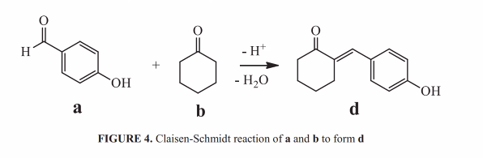

jadi bu handa harus mencari reaksi kimia nya (2 bulan mencari itu)

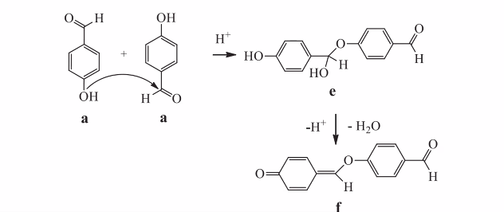

apapun hasilnya adalah tetap dilaporkan. misalnya ketika anda tidak berhasil mensitesis tidak perlu diulang itu akan memakan banyak waktu, tinggal kita laporakan saja

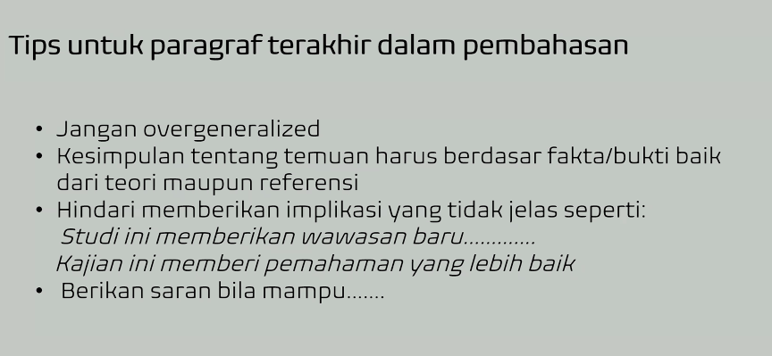

dibawah adalah paragraf terakhir dari pembahasan

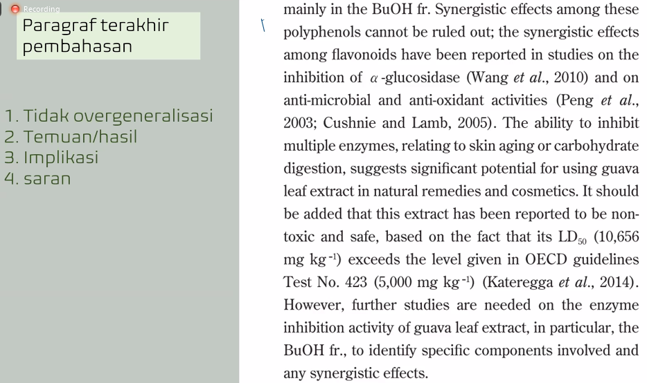

ditandai dengan **howefer ...** biasanya

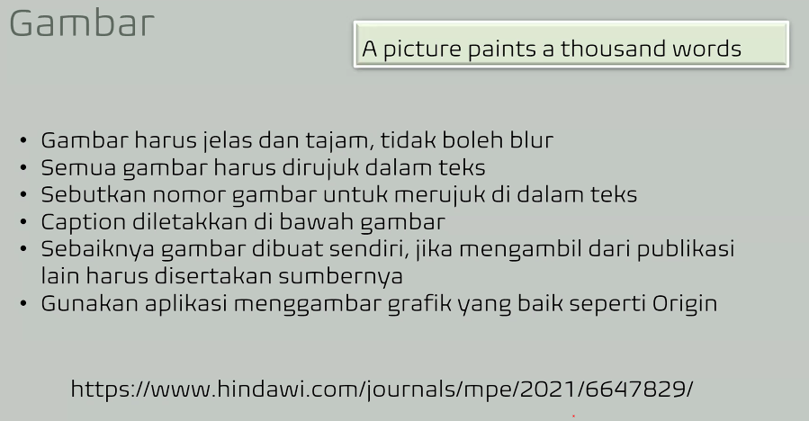

kalau ada keterangan baiknya didalam kotak, tidak boleh diluar

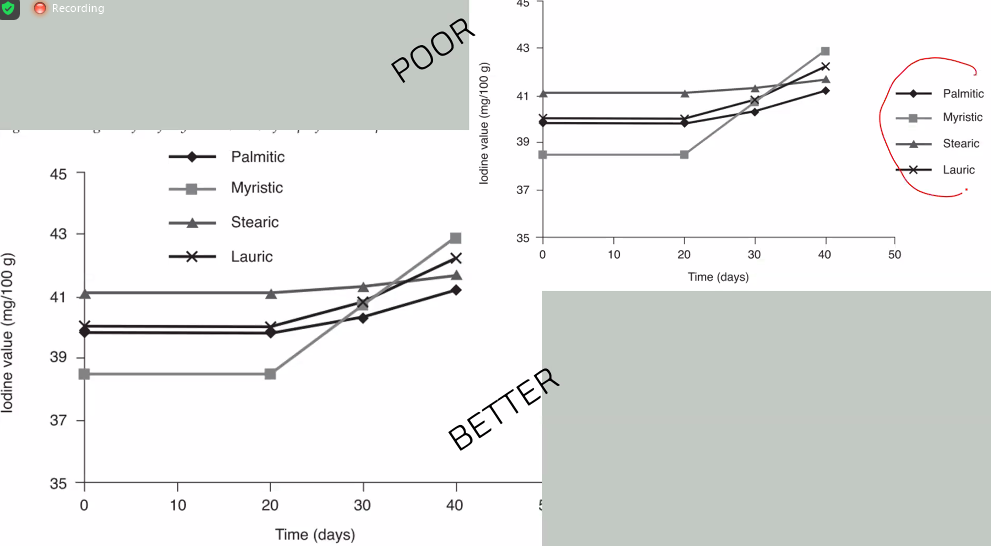

### table
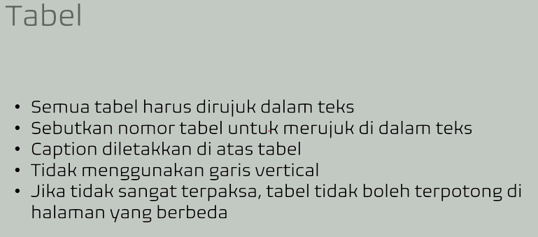

table dalam journal tidak ada garis veritkalnya, tapi kalau dilaporanya ada

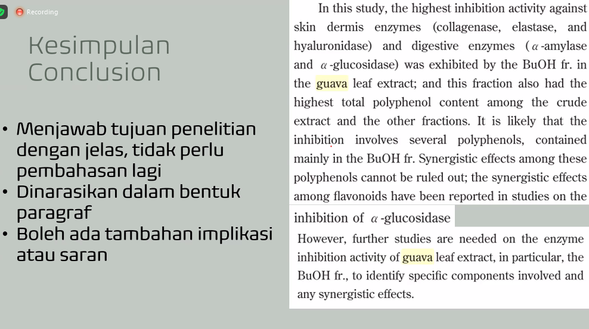

## ucapan terimakasih
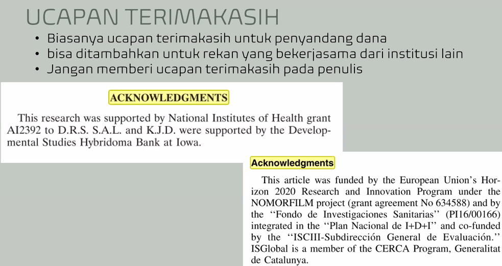

kepada yang mendanai, atau rekan. 

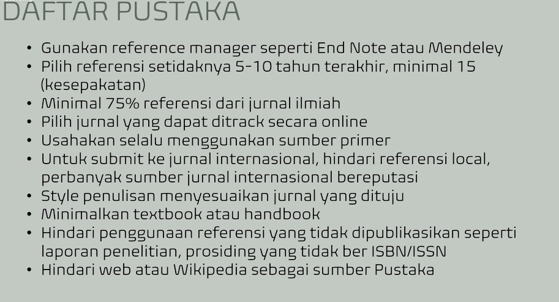

kalau mau submit ke journal internasional, daftar pustaka diusahakan berbahasa inggris, karena ketika direview tracker referensi. akan kesusahan  karena berbahasa indonesia

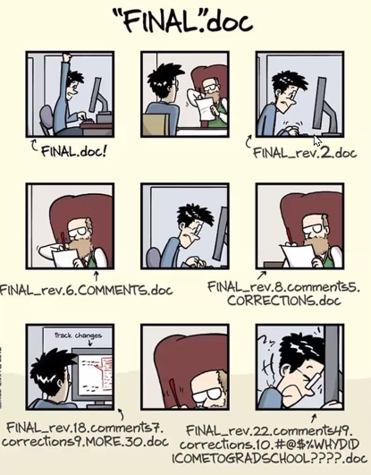