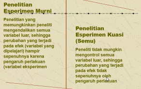
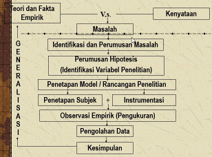
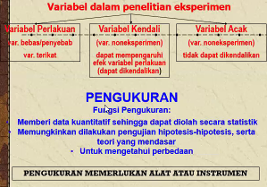
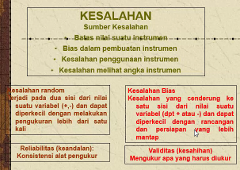

aktivitas peneliti yang dilakukan secara sitematis, ilmiah dan logis untuk menjawab berbagai pertanyaan yang timbul, memecahkan masalah, mendapatkan fakta atau prinsip-prinsip baru. 

penelitian eksperimen adalah penelitian yang observasinya dilakukan terhadap efek dari manipulasi peneliti terhadap satu atau sejumlah ciri (variable) subject penelitian. 

setiap tindakan terhadap subject penelitian yang dengan tindakan tersebut menimbulkan efek, dan efek inilah  yang kemudian dipelajari. mengubah-ubah subject penelitian. 

Hipotesis hanyalah opsional. 

variable kendali : misalnya suhu ruang itu bisa dikendalikan. uji beda adalah salah satu contoh dari uji secara statistik

sumber kesalahan bisa berupa bias dalam pembuatan instrumen, kesalahan penggunaan. 

kontrol berguna untuk menghilangkan efek variable lain yang dikhawatirkan akan mempengaruhi hasil penelitian. 

kontrol negatif dan kontrol positif. bahwa efek yang dihasilkan bahwa betul betul dari subject, sehingga kontrol negatif adalah yang tidak mengandung subject sehingga dapat dibuktikan yang tanpa subject dengan subject. jika diuji pada berbagai konsentrasi maka itu ada intervensi maka itu termasuk penelitian experimental