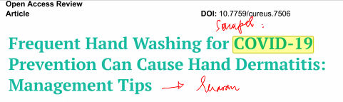

luaranya adalah management tips. 
temuanya ditulis dibelakang, sedangkan untuk dibawah ini temuanya ditaruh di awal
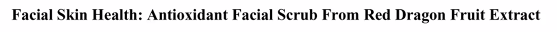

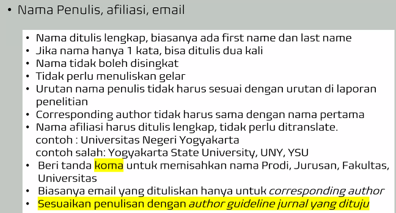

mahasiswa yang mebuat journal harus menuliskan pembimbingnya. jika anda tidak paham tentang journalnya, anda bisa mengirim email untuk bertanya mengenai journalnya. 

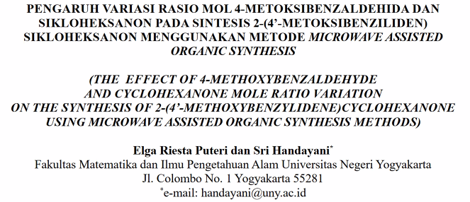

dia adalah mahasiwa uny, alumni bangkok, bimbingan bu srihandayani. 

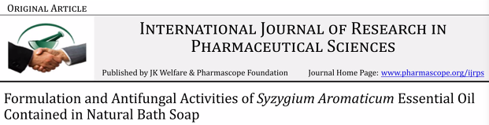

diatas findingnya adalha formulasi. variablenya adalah aktivitas antijamur

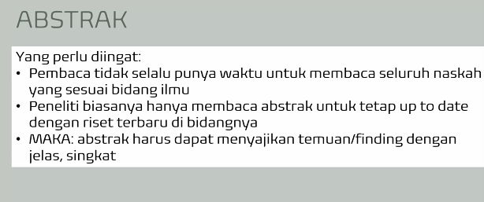

kalau kalian keburu-buru dibaca abstactnya aja. isi abstract ini:

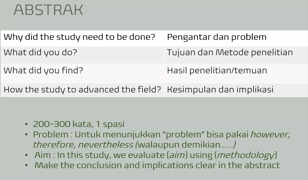

kalau bisa why did itu satu kalimat aja. abstact dilaporan dan di artikel itu biasanya beda. abstract di srkipsi adalah 3 paragraf
1. tujuan
2. metode
3. kesimpulan

kalau di journal itu bebas, tidak harus 3 paragraf. problem adalah research gap. implikasi adalah harapan dari temuan kita. misalnya judul pembuatan sabun dari daun jeruk. maka implikasinya adalah daun tidak dibuang tetapi dijadikan sabun.

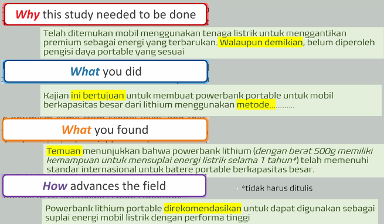

di kalimat 'walaupun demikian' itu adalah tanda tanda research gap. 

judul itu bisa diakhir setelah membuat abstract. kalau abstract nya seperti diatas harus ada findingnya (temuanya), variable, kondisi

finding : baterai portable
variable / kondisi : performa tinggi
sample : mobil listrik

judulnya bisa diltulis seperti ini
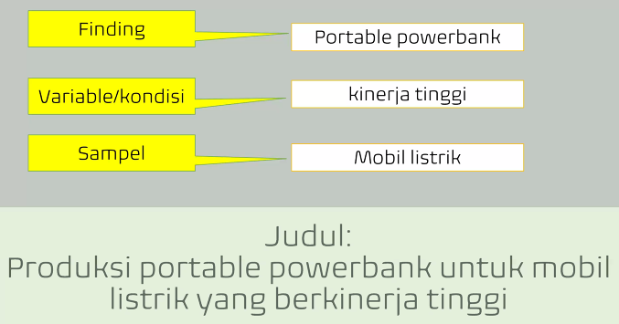

yang kiri adalah laporan / skripsi
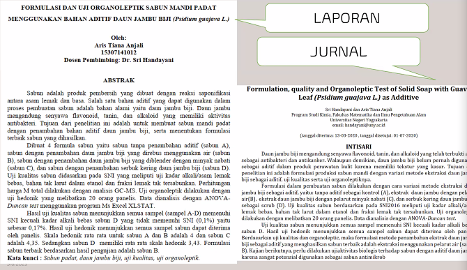

diatas nama depan adalh bu handa, sebelumnya adalah mahasiswa bu handa, sehingga reduktor menghubungi dan tidak bisa mengjawab maka diminta bu handa menjadi penulis pertama.

yang **why we must studi** di journal (kiri) ada dua kalimat. research gap : walapun demikian ...

dibawah ini adalah metodenya
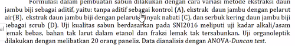

dan dibawah ini adalah implikasinya
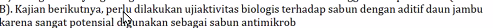

sebagiknya dalam kesimpulan abstract tidak perlu menyembutkan angka angkanya seperi dibawah ini
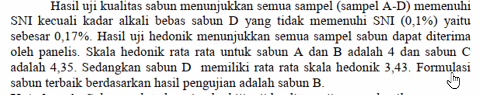

contoh identifikasi masalah 
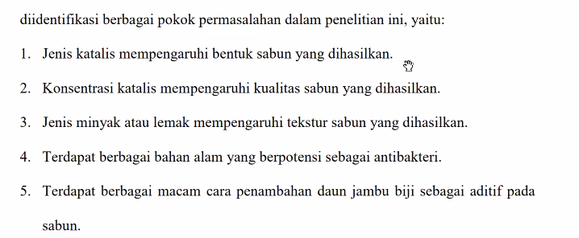
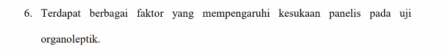

jenis minyak akan menyebabkan masalah, misalnya jika minyak kelapa saja, akan tidak berbusa, jika miunyak sawit saja maka bla bla bla...

contoh kalimat tidak bermasalah :
1. reaksi ... membutuhkan katalis ...

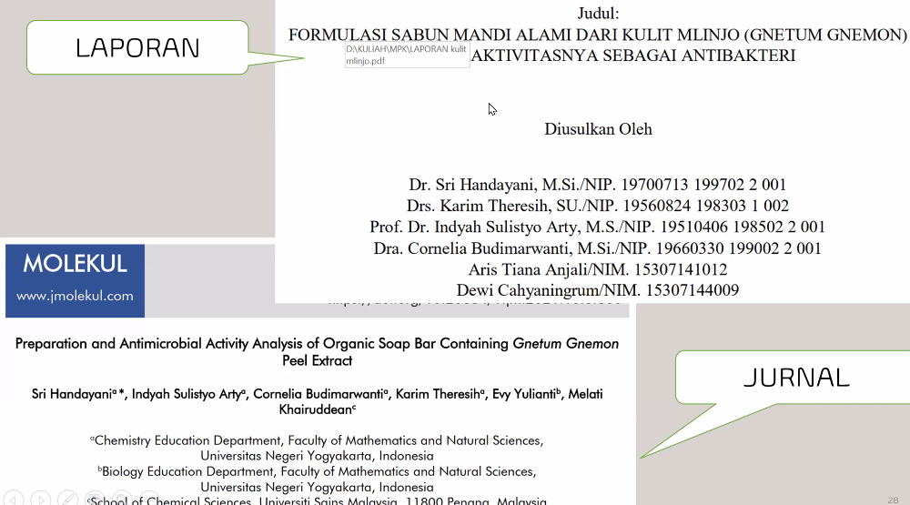

itu adalah laporan (skripsi) dan journal

dibawah adalah kalimat yang sudah menujukkan research gap
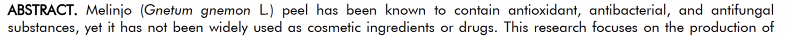

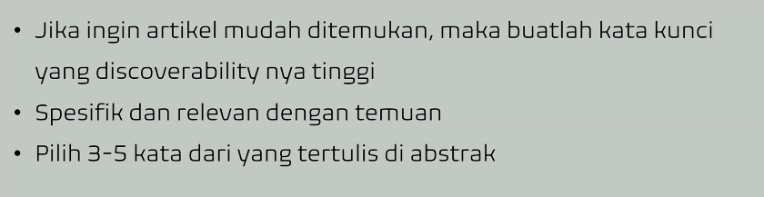

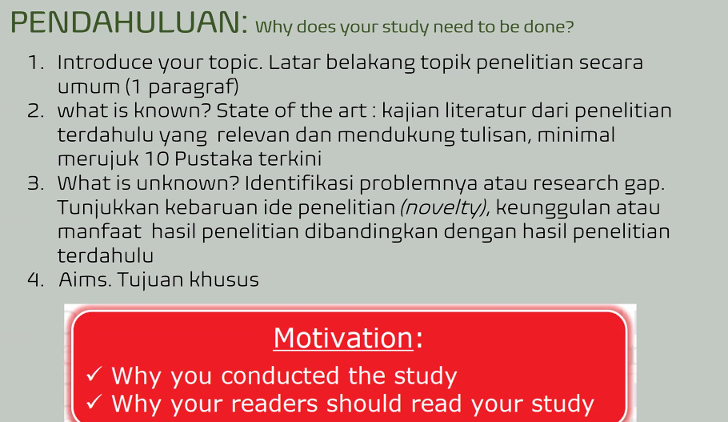

dibawah adalah penulisan yang bagus syekali, mudah dipahami

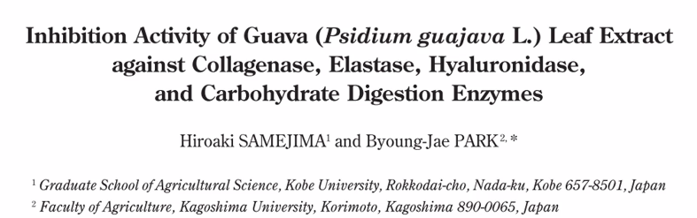

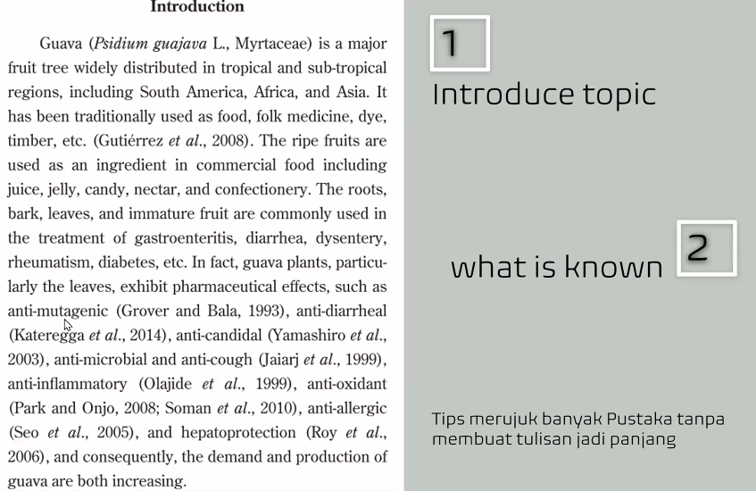

apa yang tidak diketauhi
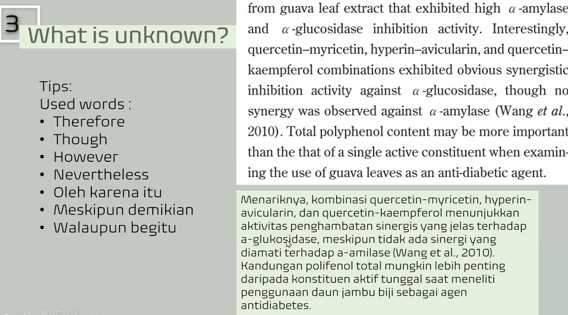

jika kalian ingin mencari research gap carilah kalimat berikut ini
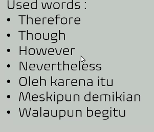

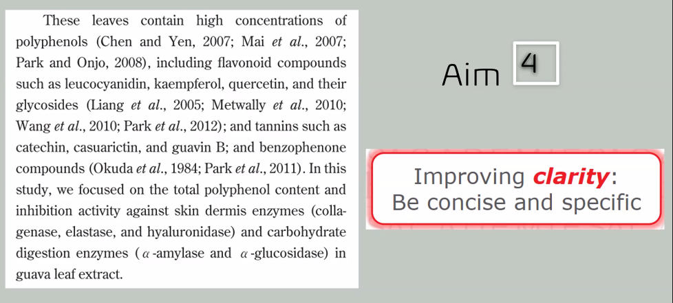

