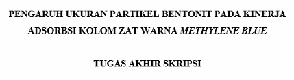

Latar belakang
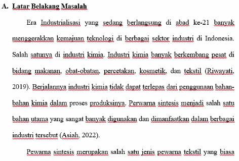
mengandung methulene blue yang sulit didegradasi alam. 
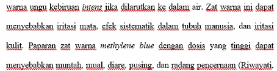
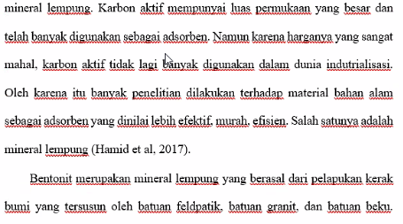

Penelitian yang relevan
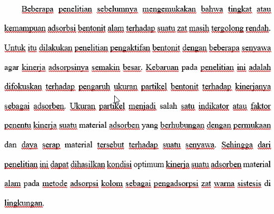
diatas juga disebutkan kebaruan penelitian yang akan dilakukan oleh peneliti.  

Identifikasi masalah
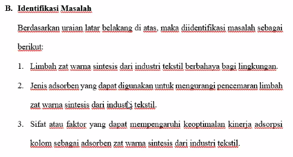	

Pembatasan Masalah
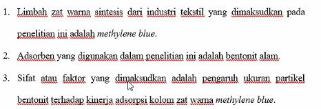

Rumusan Masalah
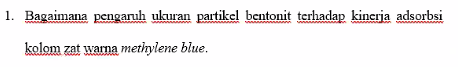

Tujuan Penelitian
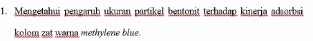

Manfaat Penelitian
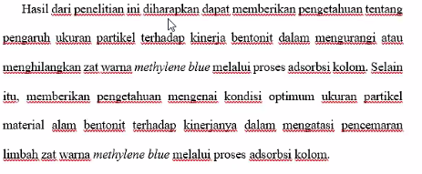

Tinjauan Pustaka
1. Bentonit
2. metylen blue
3. ukuran partikel (sebagai variabel yang akan diteliti)
4. Penelitian relevan :

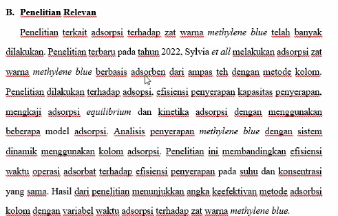

BAB III
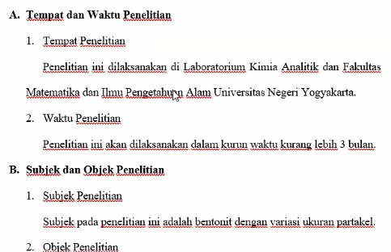

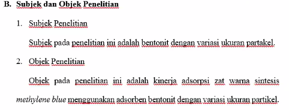

Variabel penelitian
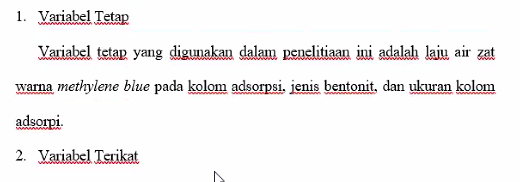
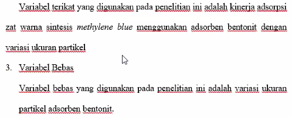

Alat dan Bahan
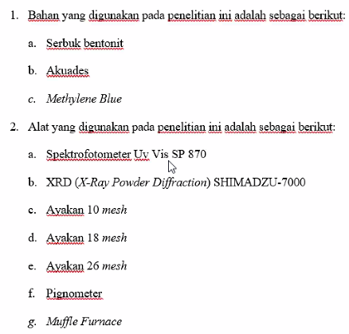

Prosedur Penelitian
Persiapan bahan
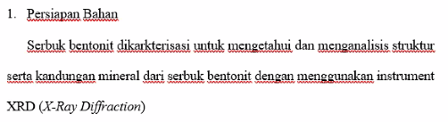

Preparasi serbuk bentonit
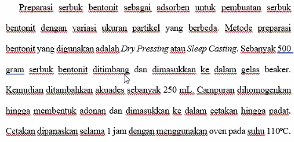
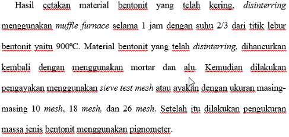
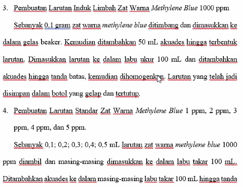
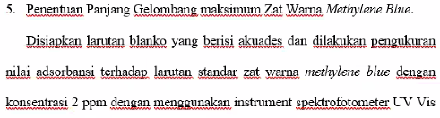

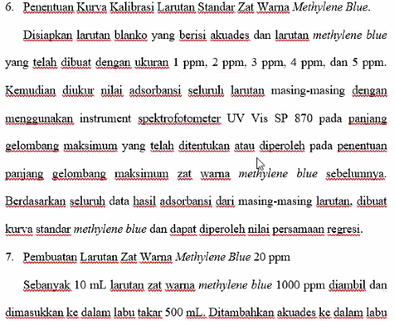