Zulfa Salsabilla

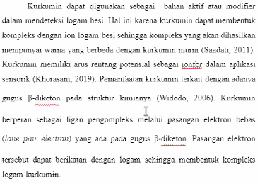

Penelitian Relevan
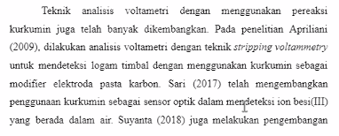
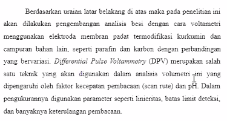

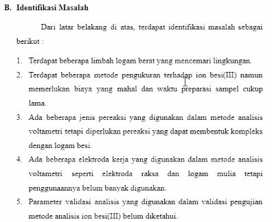
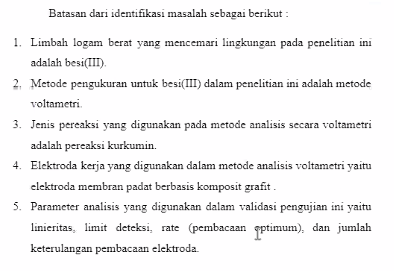

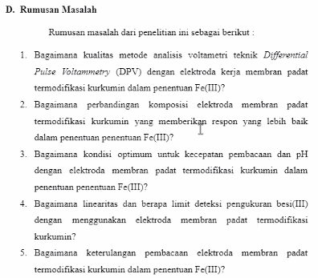

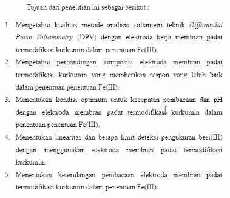

Metodologi
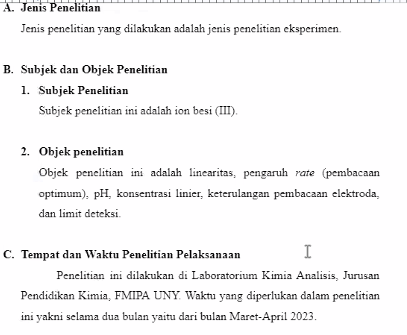
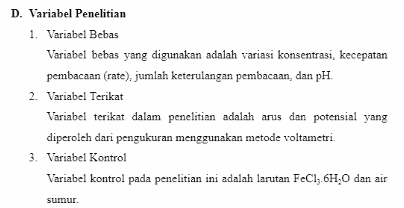
Alat dan Bahan, 

Prosedur Penelitian
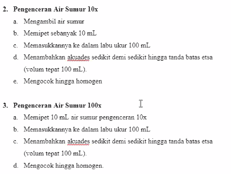
...
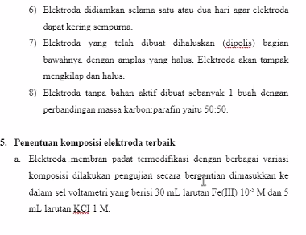
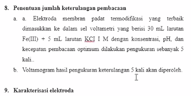
teknik analisis data
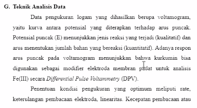

Kekurangan (koreksi sendiri)
1. Identifikasi masalah, kurang beberapa point. 
2. cerita dulu macam-macam limbah, baru diceritkaan limbah Fe. 
3. Judul, perlu dimuat dalam identifikasi masalah, dan pembatasan masalah. 
4. ditujukan, dari penelitian sebelumnya. 