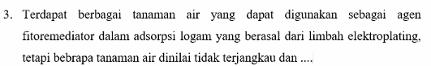
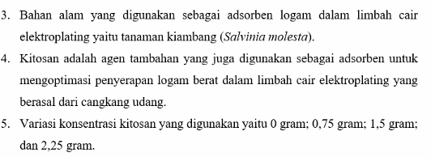
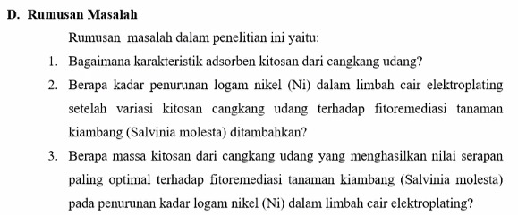
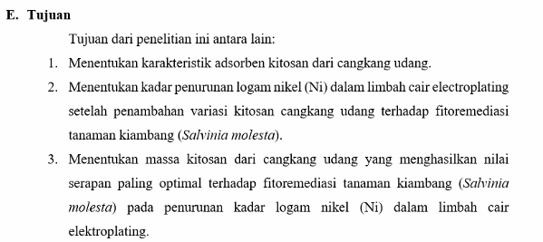
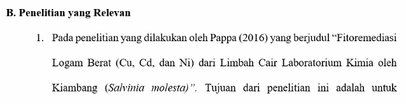
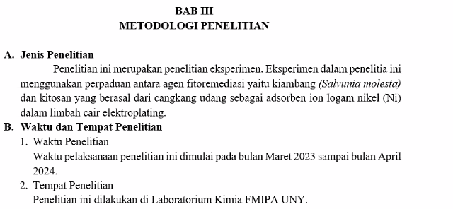
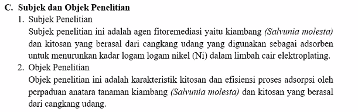

Rhiski Khusniati

itu perlu ditambahkan kenapa tidak menggunakan tanaman air yaitu tambahkan yang berlawanan dengan kecambang yang akan anda gunakan. misalnya tanaman air lain sulit untuk dicari atau tidak mudah untuk berkembang biak. 

Batasan Masalah

Rumusan Masalah

Tujuan

Penelitian Relevan, ditulis dalam list

dibuat tabel, datanya. 