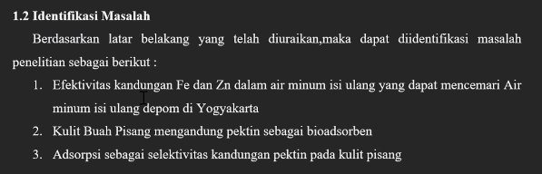
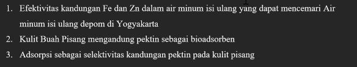
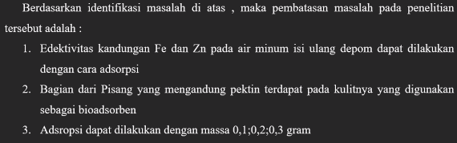
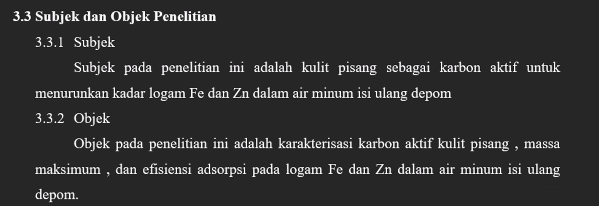
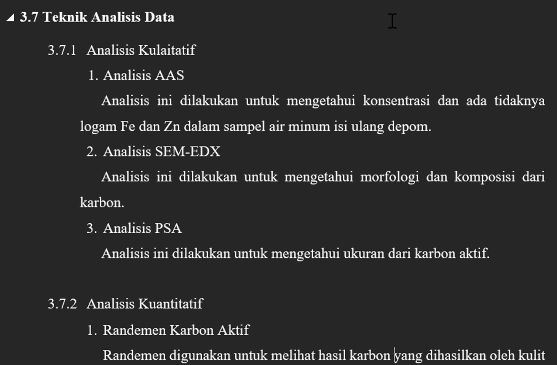

Ansius Exaudi S.

logam berat dalam DEPOM dapat bervariasi, maka ceritkaan dulu logam berat tersebut, baru diceritkaan limbah Fe dan Zn (dan alasan kenapa Fe dan Zn dipilih, apa yang membuatmu tertatik)

kulit buah pisang seharusnya disebut dalam pendahuluan. 

Identifikasi Masalah

Pembatasan Masalah

Subject dan Object Penelitian

disesuaikan dengan judul

Teknik Analisis Data

daftar pustaka tambahkan yang lebih muda-muda. 

riset gap, dan kebaruan perlu dibuat lebih explisit. 