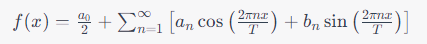
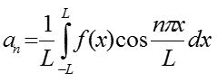
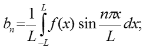
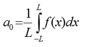
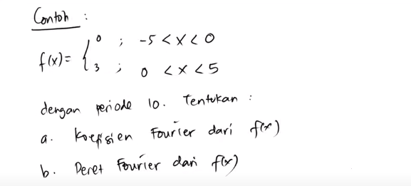
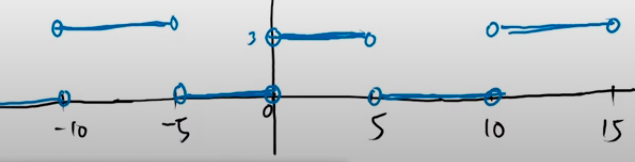
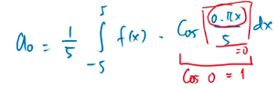
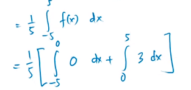

Bila f(x) merupakan fungsi periodik dalam interval (-L, L) dengan periode 2L, maka f(x) dapat dinyatakan dalam bentuk deret yang disebut **Deret Fourier** direpresentasikan dalam persamaan

dengan koefisien fourier yaitu a0 dan bn
T biasanya dinotasikan juga dengan L

f(x) adalah fungsi periodik yang akan diuraikan menjadi deret fourier

$a$n dan $b$n adalah koefisien fourier

apabila a0, maka cos akan bernilai 	1 (substitusi n dengan 0), sehingga didapatkan a0 bernilai, berlaku juga untuk b0

contoh [eL's Project Channel](https://www.youtube.com/watch?v=XjEfSdlYiO8)

-5 ke 0 berarti memiliki selisih 5
0 ke 5 berarti memiliki selisih 5

maka ketika ditanyakan dengan periode 10, sehingga $\frac{5}{10}$ menghasilkan L = 5

> apabila digambarkan dalam koordinat, didapatkan representasi sebagai berikut

	

maka a0

