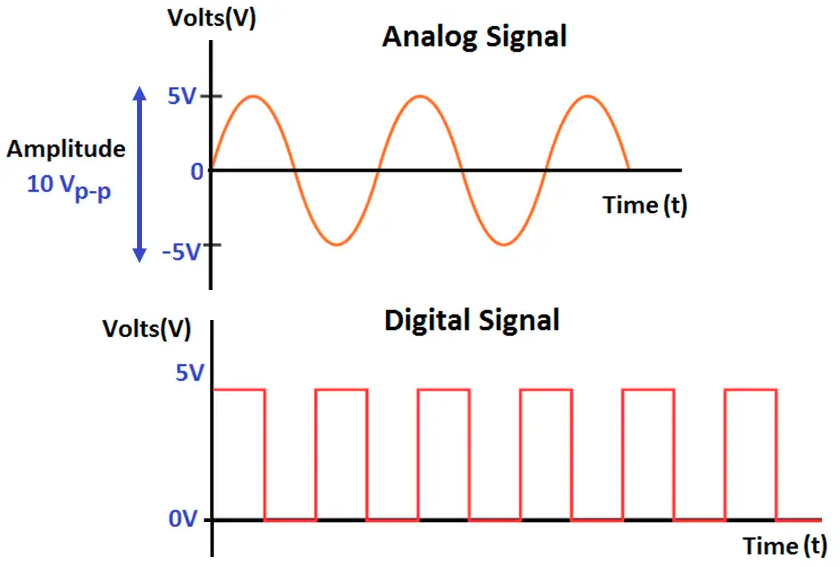

**singal analog** setiap perubahan berdasarkan fungsi waktu maupun volts memiliki nilai sehingga bersifat kontinu, bahkan pada interval limit mendekati nol
$$ \lim_{x \to 0} $$

**singal digital** setiap perubahan berdasarkan fungsi waktu maupun volts belum tentu memiliki nilai sehingga bersifat diskret. ketika dibutuhkan nilai yang sebenarnya singal tersebut tidak memilikinya, maka hanya mengambil interpolasi atau rata rata dari singal n+1 dan n-1.

$$  \sum_{}$$
sum, umum digunakan dalam singal digital

Integral, umum digunakan dalam singal analog
$$ \int $$ 
integral 1-dimensi
$$ \iint $$
integral 2-dimensi, misalnya seperti luas persegi
$$ \iiint $$
integral 3-dimensi, misalnya seperti volume persegi