- F(0) is the DC component. 
- F(1) is the fundamental frequency (Sampling frequency) component. 
- F(2) is the second harmonic (twice the sampling frequency)
- and so on.

DFT works by measuring the Correlation with an integer multiple of frequencies. Fourier transform of the original signal f(t) will be
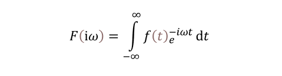
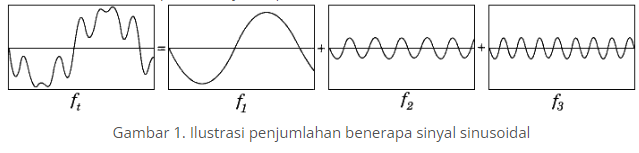

Hal yang perlu dipahami pada DFT adalah sinyal kontinyu atau sinyal analog pada domain waktu perlu diubah terlebih dahulu menjadi sinyal diskrit pada domain waktu dimana diambil nilainya pada titik tertentu pada suatu sinyal sepanjang waktu tertentu yang umumnya sering disebut sebagai sampel.

> DFT mampu mengetahui magnitude frekuensi-frekuensi pengganggu pada sebuah sinyal, atau mampu mengetahui magnitude banyak frekuensi pada suatu sinyal dimana hal ini sulit dilakukan pada domain waktu.

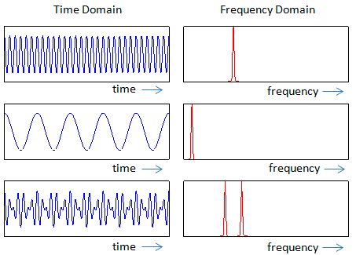

beberapa variabel sinyal pada domain frekuensi adalah magnitude, sudut (fasa) dan frekuensi. 

# Deret Fourier
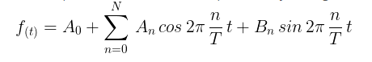
apabila dijabarkan bisa dalam bentuk seperti ini
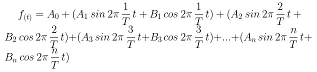.

secara teoritis, nilai N bernilai tak terhingga. tetapi pada kehidupan nyata perlu membatasi hingga nilai N tertentu. A0 dapat dikatan sebagai DC

setiap nilai magnitude pada fungsi sin (Bn) dan cos (An) pada frekuensi tertentu dijumlahkan. Untuk menjumlahkan semua magnitude di atas tidak dapat dilakukan dengan penjumlahan biasa, akan tetapi dengan menjumlahkan masing-masing  magnitude secara vector pada fungsi sin dan cos yang umumnya ditulis dalam bentuk bilangan kompleks lalu dicari resultan-nya.

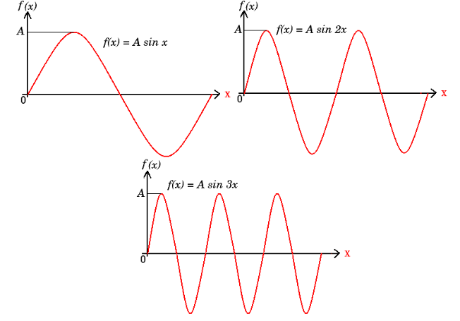
dapat ditulis sebagai berikut
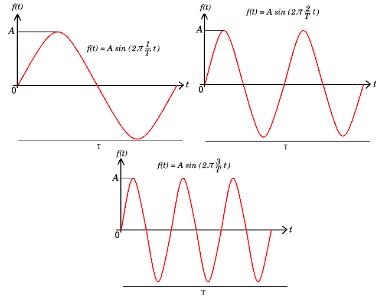
f(t) merupakan magnitude dari fungsi sin dengan satu periode putaran 2π dengan frekuensi f pada nilai t tertentu dengan magnitude maksimum adalah A.

## Bilangan kompleks
terdiri dari komponen real dan imaginary.  Dengan nilai real dan imaginary dapat dicari nilai Magnitude
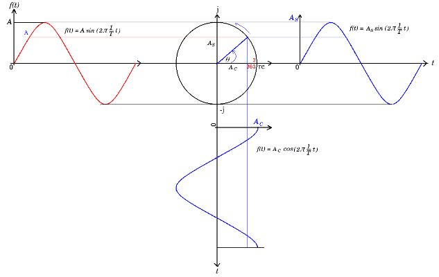
*fungsi sinyal dalam bentuk kompleks*
f(t) = A sin (2π 1/T t) dapat diasumsikan merupakan penjumlahan fungsi sin dan cos pada sinyal berwarna biru. 
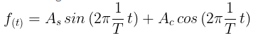

diagram fasor yang menyatakan bahwa As merupakan vector komponen imaginary dengan nilai maksimum 1j atau sering ditulis j saja. Sedangkan Ac merupakan vector komponen real dimana magnitude maksimumnya adalah sama seperti nilai maksimum fungsi cos yaitu 1 sehingga fungsi sinyal dalam bilangan kompleks
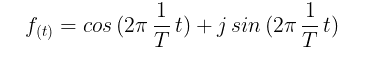

diatas merupakan awal dari representasi persamaan euler
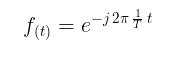

# DFT
merupakan penerapan dari deret fourier. hanya saja magnitude sinyal diambil pada waktu tertentu saja dan cukup singkat (diskrit).

Dalam satu periode terdapat total sampel yang diambil dimana total sampel tersebut lebih dikenal dengan notasi N. Kecepatan yang dibutuhkan untuk mengambil maksimum jumlah sampel pada rentang waktu tertentu disebut sebagai frekuensi sampling rate atau sample rate.

rumus DFT
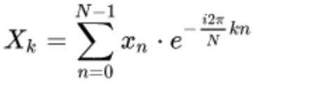
atau dapat ditulis sebagai 
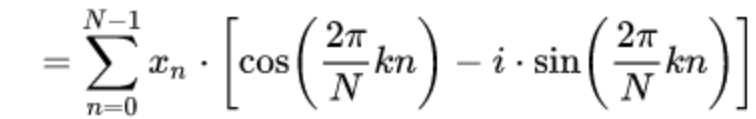

memilih salah satu metode

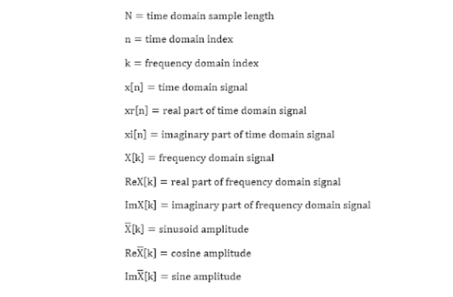

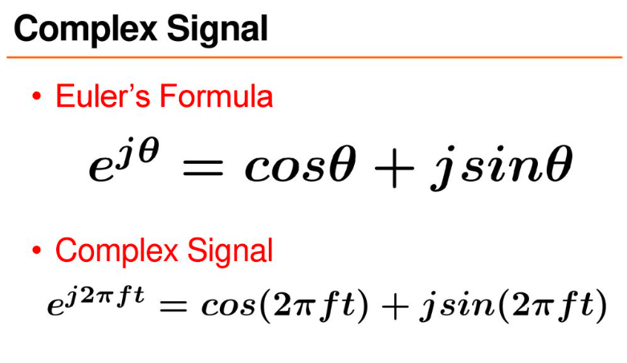

reference [*](https://www.belajarelektro.com/2021/06/dft.html)