subject ini pertama kali diasumsikan oleh Newton pada pengamatan bahwa cahaya putih tersusun atas beberapa spectrum. 
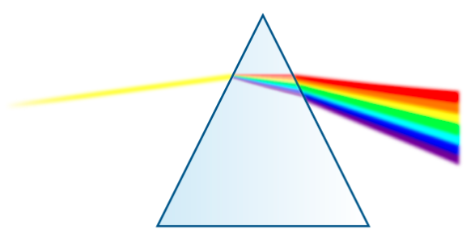

Fourier’s theory states that any periodic function can be synthesized using these sinusoidal waves. konsep penjumlahan sinusoidal disebut dengan Fourier series. 

# Deret Fourier
Deret Fourier adalah metode yang memperkirakan fungsi periodik sembarang (f(x)) sebagai jumlah tak hingga dari sinus dan kosinus dengan frekuensi semakin tinggi yang memberikan basis ortogonal untuk ruang fungsi solusi. Fungsi sinus dan kosinus hadir sebagai fungsi eigen

Dalam analisis Fourier, komponen dasar utama berasal dari sekumpulan sinusoid harmonik yang disebut sebagai set dasar. Set ini terdiri dari sejumlah tak terbatas sinusoid periodik dengan frekuensi yang berbeda-beda yang disebut sebagai harmonik. Setiap gelombang individu dalam set dasar disebut sebagai elemen dasar. Proses memecah sinyal periodik menjadi sejumlah gelombang dasar disebut Analisis. Sinyal periodik dapat dibangun kembali dengan menggabungkan (menambahkan) beberapa gelombang dari set dasar ini, yang disebut sebagai Proses Sintesis.

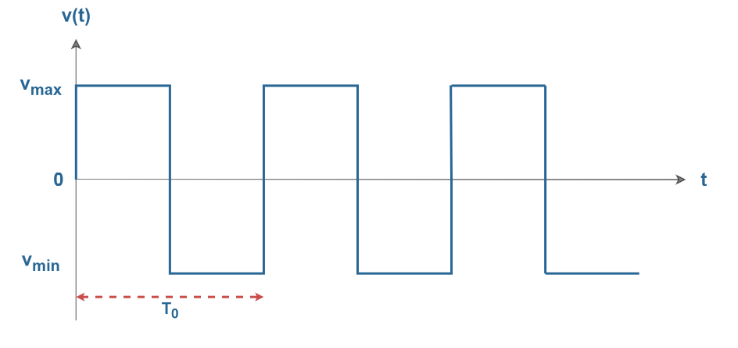
frekuensi fundamental (*1st harmonic*)

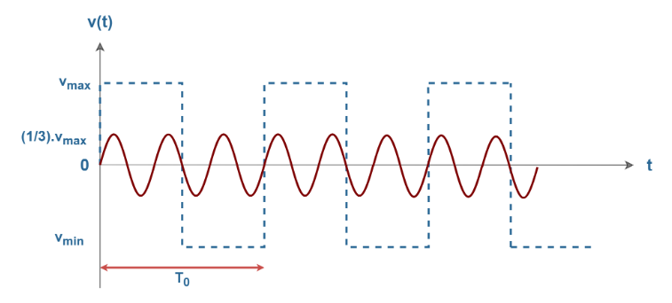
(*3rd harmonic*)

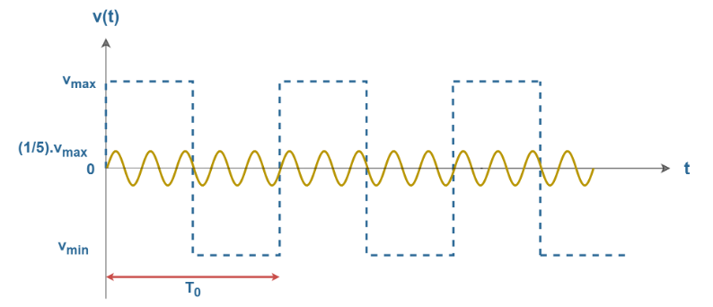
(*5th harmonic*)

*and so on ...*
> secara intuitif, pada n harmonic nilai amplitudo merupakan perkalian dari 1/n. dan merupakan kelipatan n dari freq fundamendal.

kelima harmonik ketika dijumlahkan didapatkan representasi sebagai berikut
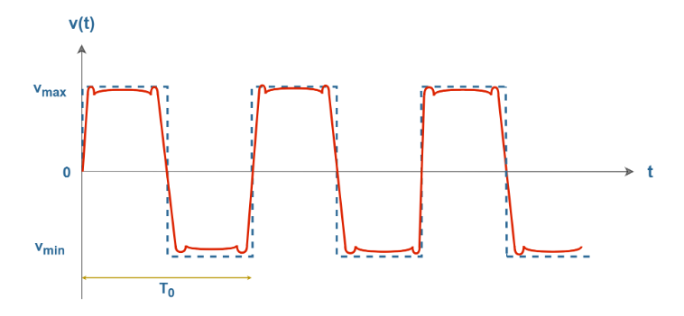
secara matematika dapat diluliskan sebagai berikut
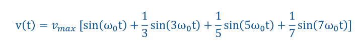

pada kehidupan nyata, misalnya gelombang singal analog dari audio.wav, dapat direkonstruksi dengan menjumlahkan sinyal sinusoidal setiap waktu yang sesuai. This is the basic idea of the Fourier analysis method. semakin banyak sinusoidal yang ditambahkan maka semakin merepresentasikan gelombang yang dianalisis.

komposisi frequensi dapat direpresentasikan
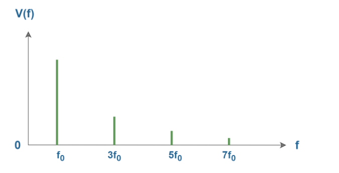
y-axis adalah nilai amplitudo frequensi. harmonik selanjutnya (3f0, 5f0, 7f0, ...) merupakan kelipatan bilangan integer dari frequensi fundamental. 

Fungsi periodik sembarang s(t) direpresentasikan sebagai berikut pada periode T0
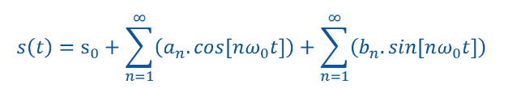
dimana omega (w) bernilai sebagai berikut
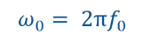

The term ω0 ((2Π/T)  represents the fundamental frequency of the periodic function f(t). The integral multiples of ω0 like, 2ω0, 3ω0, 4ω0 So on are known as the harmonic frequencies of f(t)

koefisien s0, an, dan bn disebut Fourier Series Coefficients. konstanta s0 adalah offset DC dan koefisien an merepresentasikan gelombang kosinus sedangkan koefisien bn merepresentasikan gelombang sinus

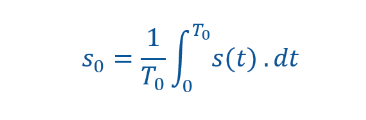
*koefisien elemen ke-n*

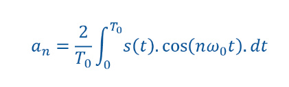
*koefisien elemen kosinus*

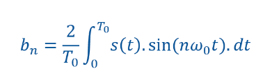
*koefisien elemen sinus*

s(t) diekspresikan dalam domain waktu. tetapi an dan bn (sebagai absolut |an| and |bn|) dapat merepresentasikan amplitudo s(t)

apabila koefisien-koefisien diatas diaplikasikan untuk mencari Fourier series coefficients didapatkan sebagai berikut
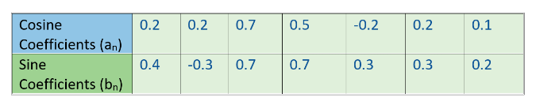
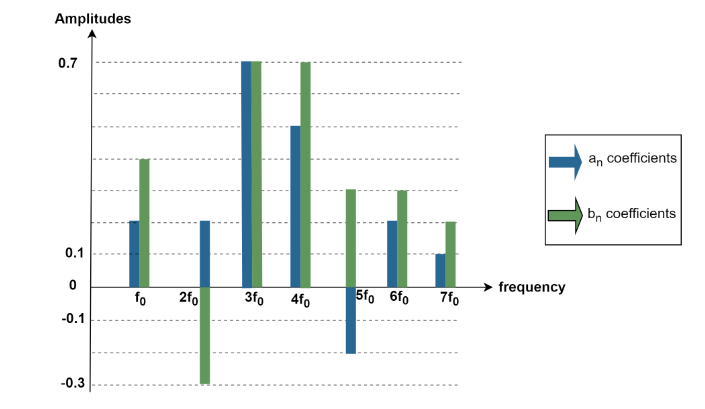
*representasi singal f(t) dalam domain frekuensi*

koefisien an dan bn dapat direpresentasikan sebagai satu variabel independen, **Cn**, yang disebut besaran (magnitude).

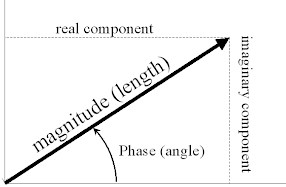

karena sinus dan kosinus saling ortogonal dan memiliki frekuensi yang sama dapat dijumlahkan sebagai dua vektor dengan metode room-sum-square

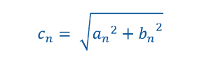

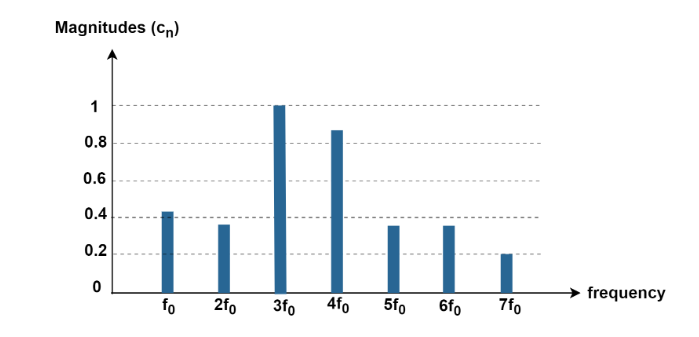
*koefisien magnitude dalam domain frekuensi*

# Fourier Transform
merupakan sebuah konsep integral dari deret fourier. Transformasi fourier merupakan analis spektrum dasar. 

bilangan komplek kemudian disebut dengan phasor.
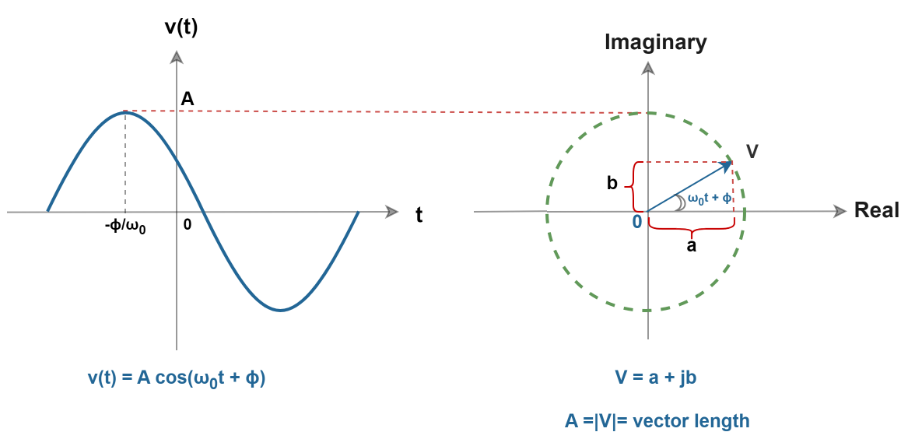
*vektor besaran sinusoidal (V) dapat diperoleh dengan vektorial real (a) dan imajiner (b), yaitu komponen sinus dan kosinus.*
menggunakan rumus euler untuk mendeskriksikan bilangan komplek V sebagai berikut

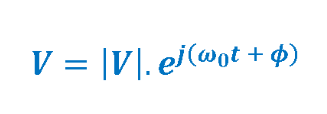
*definisi bilangan komplek V*

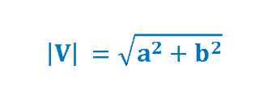
*kalkulasi magnitude V*

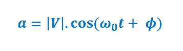
*kalkulasi komponen kosinus dari V*

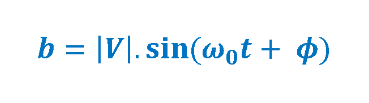
*kalkulasi komponen sinus dari V*

As already mentioned, ‘a’ equals the real part of the complex vector ‘V’ and ‘b’ equals the imaginary part of it. 

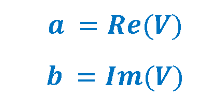
*Definisi bagian real dan bagian imajiner V*

Reference [*](https://www.electronics-lab.com/article/the-fourier-analysis-part-1/)[*](https://www.electronics-lab.com/article/the-fourier-analysis-part-2/)