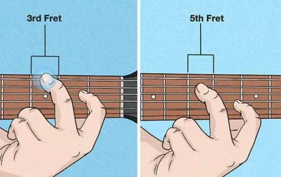
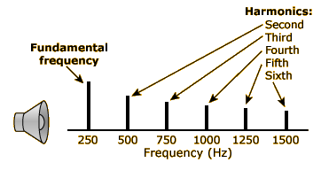
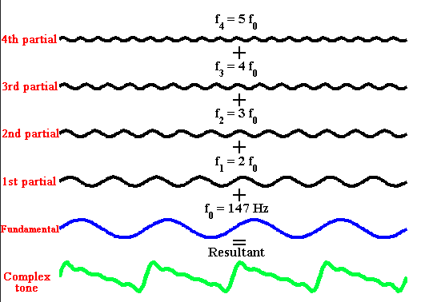

# Insights
Frekuensi fundamental adalah frekuensi terendah. yaitu memiliki tingkat keberulangan paling rendah dalam sinyal tersebut. kemudian harmonik (overtones) adalah kelipatan integer dari frekuensi fundamental. 

Misalnya, jika frekuensi fundamental dari sebuah nada adalah 440 Hz, maka nada tersebut merupakan nada A pada oktaf keempat di tangga nada internasional. Komponen frekuensi lain dalam suara tersebut adalah kelipatan 440 Hz, seperti 880 Hz (oktaf kedua) atau 1320 Hz (oktaf ketiga) dst, dan mereka berkontribusi pada karakteristik khusus dari suara tersebut.

*oktaf*

ketika fundamental dan harmonik dijumlahkan

> sinusoids adalah gelombang yang mirip dengan fungsi sinus atau cosinus
