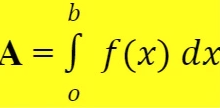
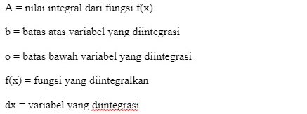
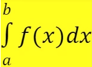
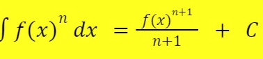

integral masuk kedalam rumpun kalkulus. disebut juga dengan antiturunan. 

Kalau ada sebuah fungsi f(x) diturunkan, maka menjadi f’(x). Nah, integral kan kebalikannya turunan, jadi f’(x) dibalik lagi. Maka, hasilnya balik menjadi f(x).

## Integral Tentu
Integral tentu adalah integral yang udah punya nilai awal dan akhir, punya batas yang jelas.

## Integral Tak Tentu
integral tak tentu nggak punya batas dan belum punya nilai yang jelas. Nilai yang nggak jelas ini dilambangkan dengan konstanta ( C ). Sedangkan, lambang integral tak tentu nggak punya batas atas dan batas bawah, karena nggak terbatas.

***
Hitung integral tentu dari fungsi $(f(x) = 2x^2 + 3x - 5$) dari $(x = 1$) hingga $(x = 4$). **Jawabanya adalah** $(\frac{269}{6}$).

menggunakan python: 
## SciPy
	from scipy import integrate
	def f(x):
    	return 2*x**2 + 3*x - 5
	x = [1, 4] #batas bawah ke batas atas
	result, _ = integrate.quad(f,x[0] , x[1])
	

