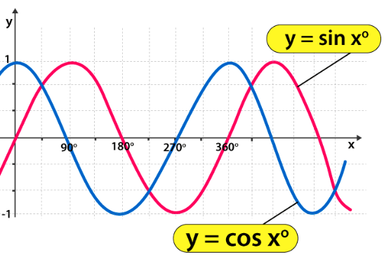
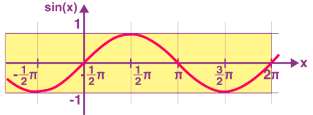
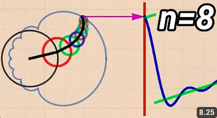
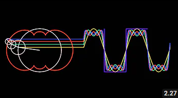
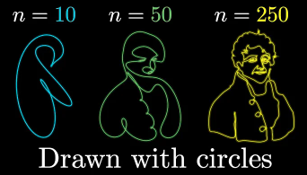

Deret fourier (dibaca Fouye) adalah deret tak hingga yang setiap sikunya berbentuk sinus dan/atau cosinus

deret fourier digunakan untuk menjelaskan fungsi periodik, yaitu fungsi yang bentuknya tetap untuk periode yang sama. misalnya sebuah fungsi f(x) = sin(x)

satu gelombang = satu periode = 1T  direpresentasikan dengan 2 pi. sehingga **T = 2 pi**. 

> Lingkaran memiliki sudut penuh (360 derajat atau 2 pi radian). Ini juga digunakan bahwa 1 gelombang penuh sinus = 2 pi

Fungsi f(x) dikatakan periodik dengan periode P, apabila untuk semua harga x berlaku: f(x+P) = f(x); dimana P adalah konstanta positif

Fungsi sin x mempunyai periode 2π, 4π, 6π,…
karena sin (x+2π) = sin (x+4π)= sin (x+6π)  =…=sin x

> Periode dari tan x adalah π

suatu fungsi f(x) dikatakan fungsi periodik dengan periode T jika setiap x berlaku f(x + T) = f(x). contoh f(x) = sin(x) dengan T = 2π

dengan ilustrasi dibawah, mungkin bisa memberikan pemahaman secara intuitif [*](https://youtu.be/WSkczQe6YxA)

