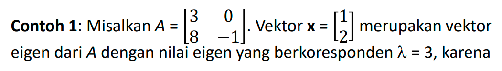
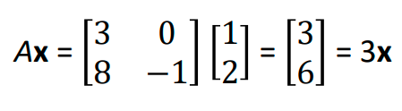
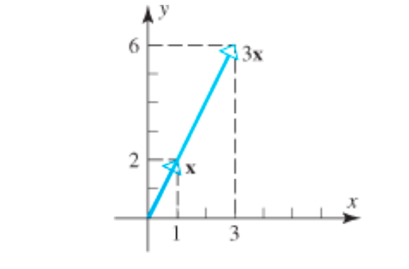

Nilai eigen adalah solusi dari persamaan matriks
Ax = λx
A adalah matriks, x adalah vektor, dan λ (lambda) adalah nilai eigen. Nilai eigen adalah bilangan skalar yang memberikan informasi tentang bagaimana matriks A mempengaruhi vektor x

Dengan kata lain, nilai eigen menyatakan nilai karakteristik dari sebuah matriks yang berukuran n x n.

Dengan kata lain, operasi Ax = λx menyebabkan vektor x menyusut atau memanjang dengan faktor λ dengan arah yang sama jika λ positif
dan arah berkebalikan jika λ negatif.

> nilai eigen matriks operator Hamiltonian dalam mekanika kuantum akan menggambarkan energi-energi yang mungkin dalam sistem.

