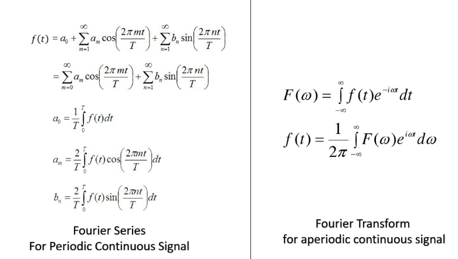

dalam kehidupan nyata, sering dihadapkan pada persoalan diferensial, misalnya seperti bunga majemuk. persamaan differensial menggambarkan perubahan tambahan yang bergantung pada perubahan lainya. 

Fourier series (deret fourier) digunakan untuk singal periodik, sedangkan transformasi fourier digunakan untuk singal non periodik. 

Tetepi, Fourier series gives the **discrete frequency domain** of a periodic signal, The Fourier transformation gives the **continuous frequency domain** of a nonperiodic signal.

Just remember one thing [ ] denotes discrete signal and ( ) represents the continuous signal.
