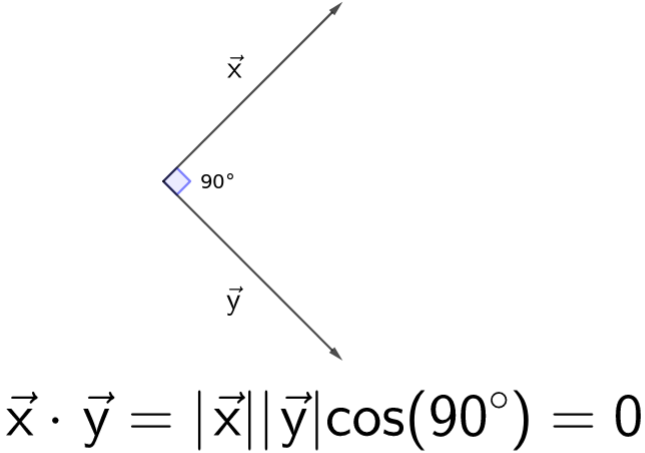
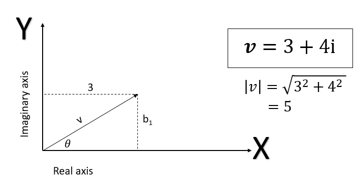

Jika Anda mengamati sudut antara vektor A dan vektor B, Anda akan menemukan bahwa mereka saling tegak lurus (sudut 90 derajat). Karena itulah, vektor A dan vektor B disebut sebagai vektor orthogonal satu sama lain.

pytagoras yang diaplikasikan pada vektor
