di alam yang melimpah adalah visibel, bukan UV.
deffect effect akan memberikan efek terhadap sinar tampak
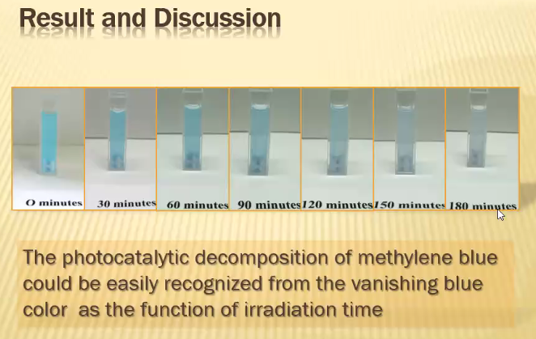

Kesimpulan
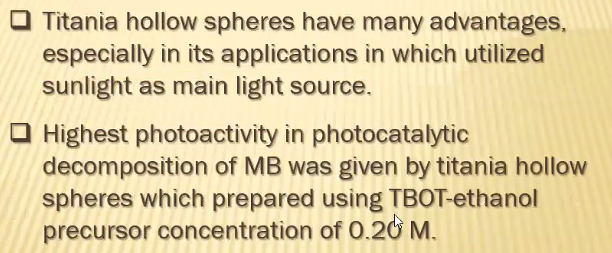

peralatan UV-Vis liquid
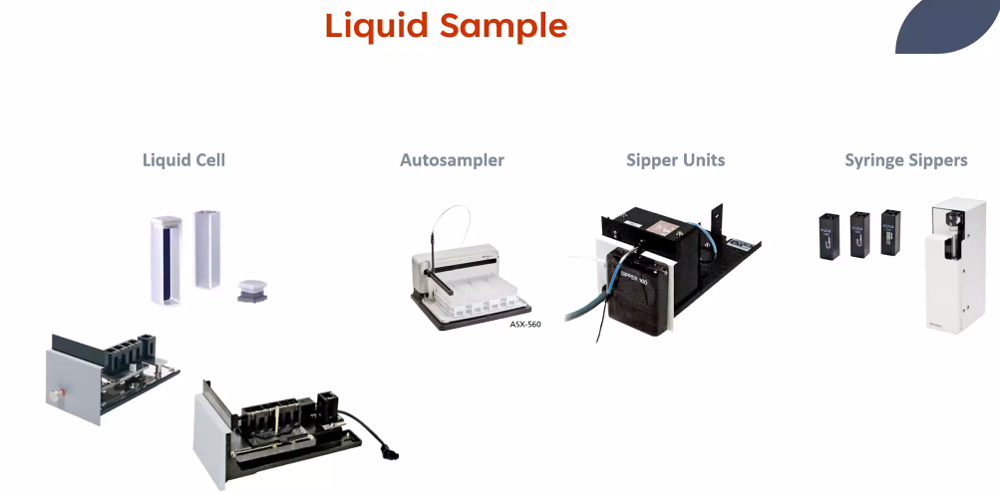

Cuvet type
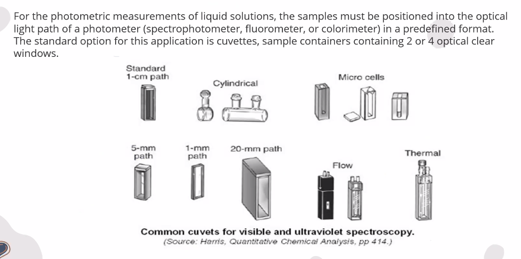
biasanya yang ukuranya 1cm path. 

cuvet thermal, menjaga suhu sampel untuk sampel yang sensitif terhadap suhu. 

serapan kuvet tidak boleh memiliki serapan panjang gelombang sama seperti sampel
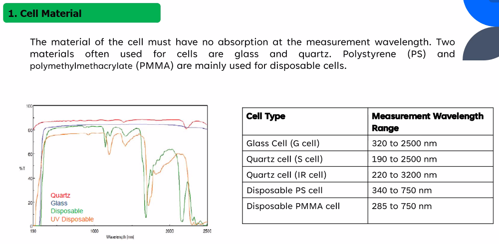
sering digunakan adalah kuvet kuarsa. 

kuvet panjang
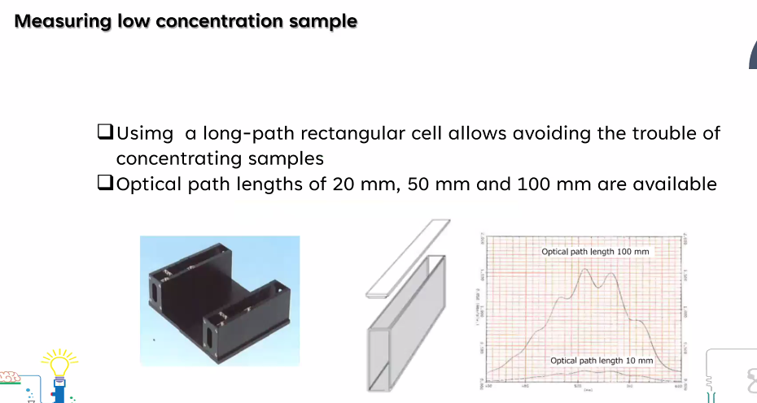
berpengaruh pada hasil pengukuran. 

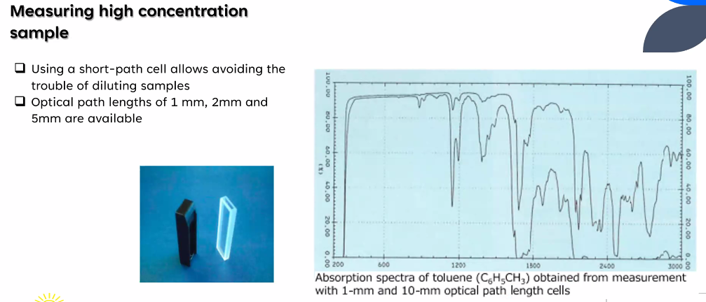
mengecilkan konsentrasi ,dapat dengan mengganti saja kuvetnya panjangnya. 

perhatikan sisi optik dan sisi buram dari kuvet.

sampel padat bisa juga
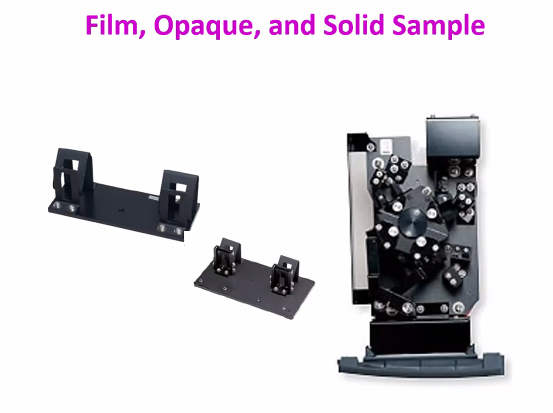

solid, terjadi reflactan
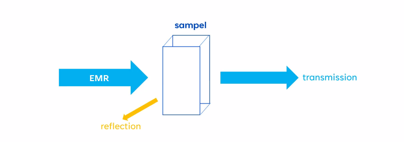

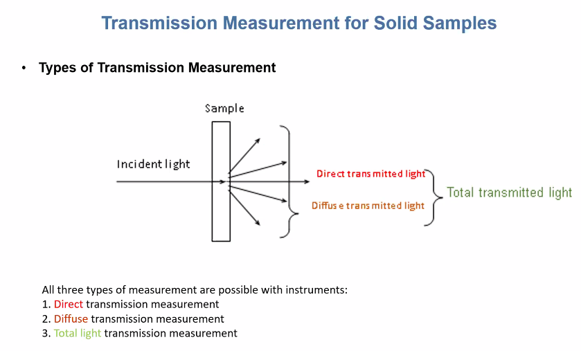
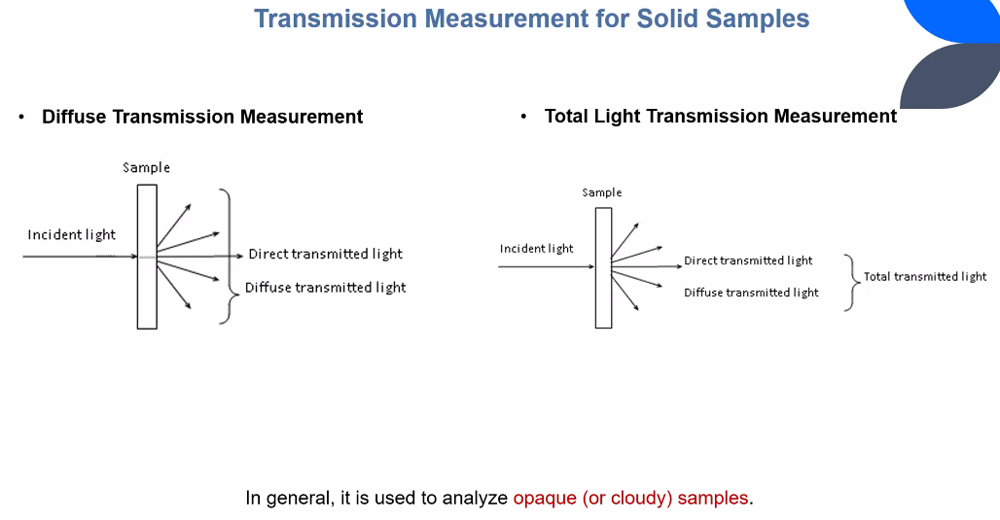
ada juga dengan reflactan
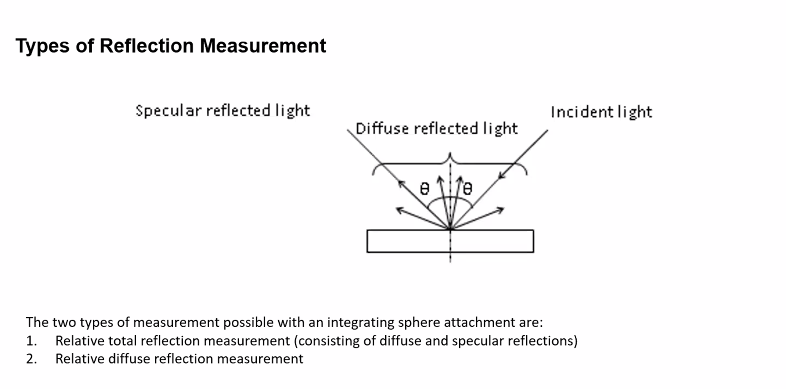 

4 metode untuk mengukur sampel solid
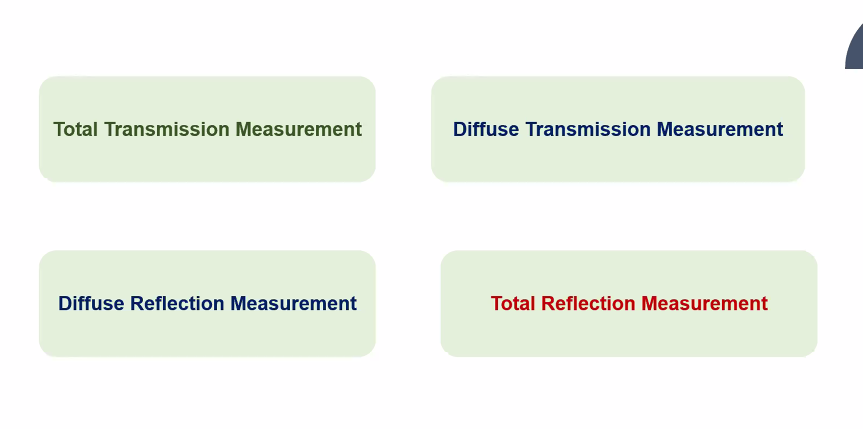. 
bisa pakai instrumen ini
