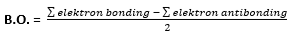
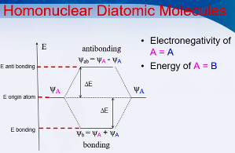
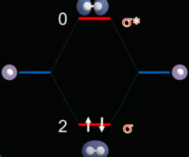
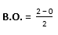
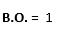

## Order bond

dalam teori orbital molekul ada istilah order bond yang didefinisiakn sebagai selisih antara jumlah elektron bonding dengan jumlah elektron antibonding dibagi 2 atau setengahnya, sehingga secara matematis dapat ditulis seperti ini :

ketika BO (Bond Order) :
BO = 0, maka molekul tidak stabil
BO > 0, maka molekul stabil
BO < 0, ini tidak mungkin

dari formula diatas setidaknya dapat diprediksi sifat molekul tersebut meliputi energi dan kemagnetan.

### Energi

Bond Order yang semakin besar menghasilkan ikatan yang semakin pendek, maka energi untuk memutus semakin besar, maka semakin stabil.

### Kemagnetan

pada dasarnya, ketika molekul tersebut mempunyai elektron yang tidak berpasangan maka ia bersifat paramagnetis, sedangkan apabila tidak ada yang tidak berpasangan(berpasangan semua) maka ia bersifat diamagnetis

* * *

## Contoh

contoh disini hanya untuk molekul homonuklir (homopolar). homonuklir atau homopolar  misalnya molekul diatomik yang terdiri atas 2 atom yang sama, O2, N2, dst.

gambar diatas merupakan diagram untuk molekul homonuklir dimana elektronegatifan antara 2 atom pembentuk molekul (psi A dan psi B) adalah sama, begitu juga dengan energinya. dari diagram dapat dilihat bahwa antibonding memiliki energi yang lebih tinggi dibandingkan bonding maupun energi atom asalnya (origin atom) atom direpresentasikan sebagai gelombang (phi). ikatan yang melemahkan(antibonding) merupakan pengurangan dari fungsi gelombang (phi). itu sebabnya orbital 'bonding' akan diisi elektron terlebih dahulu karena energinya jauh lebih rendah dibanding orbital 'antibonding'. mari diaplikasikan pada molekul H2

kiri adalah atom H (atom Hidrogen A) sedangkan kanan adalah atom H (atom Hidrogen B). Atom H memiliki 1 elektron, sehingga ketika ada 2 atom H yang menjadi molekul H2, maka masing masing elektron akan bersatu menjadi 2 buah elektron (direpresentasikan sebagai panah ↑ ↓) pada orbital bonding (sigma). orbital bonding memiliki tingkat energi yang lebih rendah sehingga ia akan lebih mudah diisi elektron dari pada orbital antibonding (sigma*). setelah itu masukkan nilai yang didapat kedalam rumus order bond:

hasil akhir didapatkan bahwa nilai B.O. adalah 1. maka ikatan molekul dihidrogen, seharusnya memiliki 1 ikatan (karena B.O adalah 1) dan ya memang itu adalah kenyataanya, molekul dihidrogen berada di alam dengan ikatan rangkap 1. Bond order terkadang menghasilkan angka desimal, hal itu terjadi karena resonasi(lihat materi di kimia organik). sifat lainya yang dapat diprediksi adalah kemagnetanya, karena pada diagram tersebut tidak ada elektron yang tidak berpasangan maka molekul tersebut bersifat diamagnetik. Contoh lainya adalah untuk molekul homonuklir He2 dengan diagram orbital molekul sebagai berikut

atom He memiliki elektron berjumlah 2, ketika 2 buah atom He digabungkan maka akan ada 4 elektron yang mengisi orbial molekul. jika dimasukkan dalam formula diatas didapatkan bahwa nilai B.O. adalah 0 yang artinya molekul tersebut tidak stabil dan tidak akan ditemukan di alam.