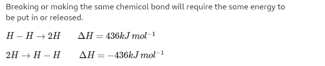
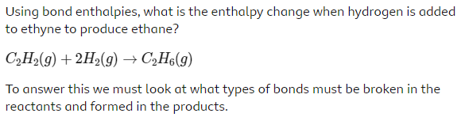
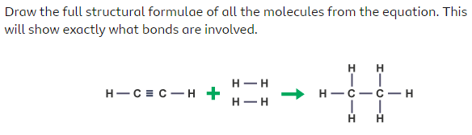
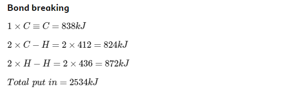
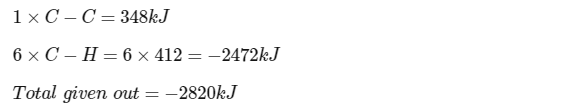
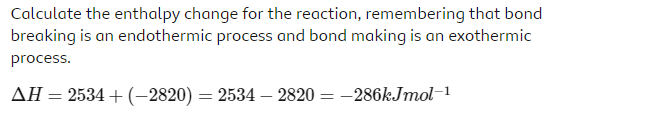

Energi diperlukan untuk memutus ikatan antar dua atom. Pemutusan ikatan adalah proses endotermik

> endotermik berarti menyerap panas

maka berlaku sebaliknya, Energi dilepaskan ketika ikatan kimia baru terbentuk, sehingga pembentukan ikatan merupakan proses eksotermik. misalnya

> The values for bond enthalpies are found in the data book 	
rr
Energi yang dibutuhkan untuk memutuskan **ikatan tunggal karbon ke karbon** (C-C) dalam etana (C2H6) akan berbeda dengan energi yang dibutuhkan untuk memutuskan **ikatan tunggal karbon ke karbon** dalam dekana (C10H22).

Entalpi ikatan yang dikutip dalam buku data adalah energi yang diperlukan untuk memutus satu mol ikatan antara sepasang atom dalam keadaan gas.

***
Misalnya, 

**Jawab**

Make a list of all the bonds being broken in the reactants and their bond enthalpies using the data book.

Kategori pemutusan ikatan

Kategori pembentukan ikatan

setelahnya dijumlahkan
