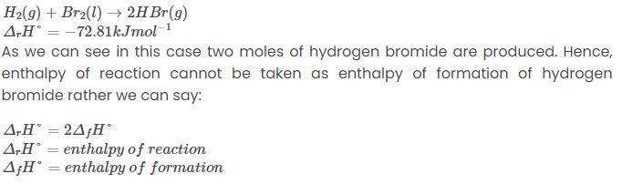

Entalpi pembentukan (ΔHf)  `f for formation` adalah jumlah panas yang dilepaskan atau diserap (kJ/mol) saat satu mol zat terbentuk dari unsur-unsurnya dalam keadaan standar (tekanan 1 atm dan suhu 25°C). 

Defined as the enthalpy change when one mole of a compound is formed from its elements in their most stable state in 298.15 K, 1 atm.

Enthalpy of formation is basically a special case of standard enthalpy of reaction where two or more reactants combine to form one mole of the product

-2SegitiafH karena 2HBr

Semua unsur dalam keadaan standarnya (gas oksigen, karbon padat dalam bentuk grafit, dll.) mempunyai entalpi pembentukan standar nol.
