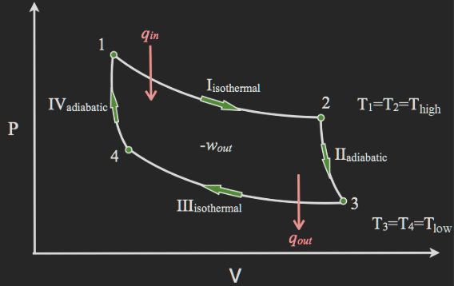
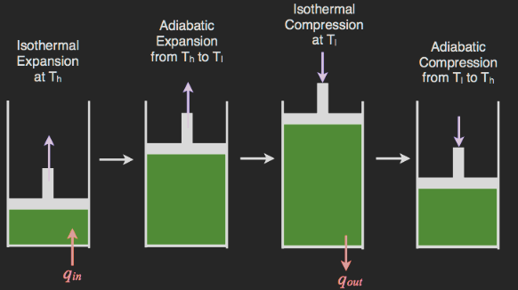
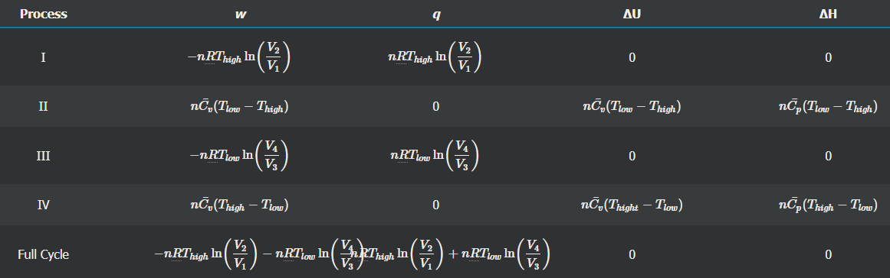
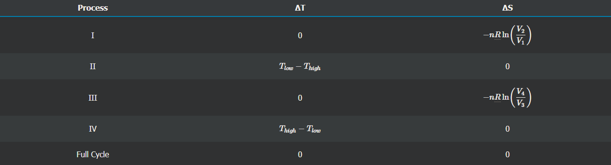

Rentang isotermal yaitu pada siklus I dan II, nilai delta U adalah nol karena delta T adalah 0

> delta U adalah perubahan energi internal, delta T adalah perubahana temperature

siklus isotermal adalah adanya temperature yang konstan dari lingkungan, temperature konstan tersebut diberikan pada piston.

siklus adiabatik, adalah tidak adanya pertukaran panas (dari gas) yang terjadi dengan lingkungan, sehingga q bernilai nol. 

> q adalah jumlah panas yang dipindahkan (Joule)

> q bernilai negatif ketika panas dipindah dari sistem ke lingkungan, dan sebaliknya

Pengukuran setiap siklus dapat dilakukan melalui perhitungan berikut
 	

Pengukuran delta S (entropi)  setiap siklus

$$q_{in}$$ 
gas absorbs

$$T_{high}$$ 
higher temperature

reference[*](https://chem.libretexts.org/Bookshelves/Physical_and_Theoretical_Chemistry_Textbook_Maps/Supplemental_Modules_(Physical_and_Theoretical_Chemistry)/Thermodynamics/Thermodynamic_Cycles/Carnot_Cycle)