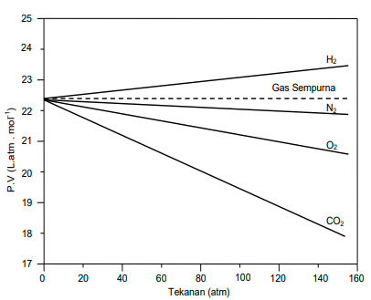
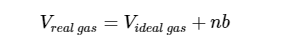
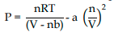
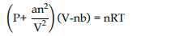

makin besar tekanan makin besar pula peyimpangan gas nyata terhadap gas sempurna. Pada limit tekanan nol atmosfer semua gas akan bersifat seperti gas sempurna 

# Persamaan Van der Walls
persamaan gas nyata dievaluasi berdasarkan persamaan gas ideal, dengan menyadari bahwa setiap atom akan berinteraksi satu sama lain.

persamaan menurutnya dirumuskan sebagai 

atau ditulis ulang menjadi 

`nb` perkiraan volume total yang ditempati molekul-molekul gas
`a` konstanta khas setiap gas
$$ -(\frac{n}{V})^2 $$
menyatakan pengurangan tekanan. 

`The improved fit is obtained by introducing two parameters (designated “ a” and “b”) that must be determined experimentally for each gas.`

## Volume, tekanan, dan temperature kritis
kritis menyatakan sebuah puncak suatu kurva. syarat titik puncak adalah turunan pertama dan kedua dari fungsi bernilai 0.

