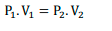
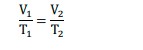
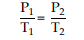
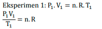
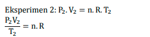
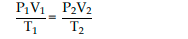
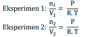
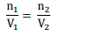
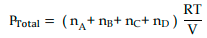

ketiga elemen menunjukkan hubungan linear yang satu sama lain yang direpresentasikan seperti berikut

**PV** = nR**T**

### Boyle

### Charles

> satuan V adalah Liter (1000ml)
### Gay-lussac

> satuan P adalah atm

> satuan T adalah kelvin (+273)
### Gabungan

nilai `n` dan `R` pada `t0` sama dengan nilai `n` dan `R` pada `t1`, sehingga dapat dituliskan kembali menjadi

### Avogadro

> satuan n adalah mol

### Hukum dalton
menyatakan tekanan total yang ditimbulkan oleh
campuran gas merupakan jumlah tekanan yang ditimbulkan dari masing masing jenis gas. 

