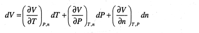
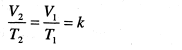
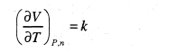
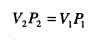
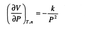
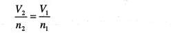
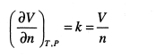

Fungsi yang memperlihatkan ketergantungan volum suatu gas terhadap suhu, tekanan, dan jumlah mol gasnya.

	V = V(t,p,n)
	
besarnya perubahan volume yang diakibatkan parameter tersebut ditulis sebagai 

kuosien pertama `(doV / doT) p,n`  menyatakan perubahan volum yang diakibatkan berubahnya suhu pada tekanan dan jumlah mol tetap. 

> oleh karena itu, perubahan volum total gas yang diakibatkan berubahnya suhu, tekanan, dan jumlah mol dapat diketahui jika semua kuosienya diketahui

persamaan gas ideal dapat diturunkan dari pendekatan diantaranya menggunakan pendekatan beberapa hukum gas yang telah dikenal.

## Gay lussac dan charles
pada tekanan tetap, maka volume gas berbanding lurus dengan suhu termodinamik `V \approx T`  atau `V = kT` atau dapat ditulis ulang sebagai

berdasarkan koesien pertama, maka diperoleh k sebagai

## Boyle
pada suhu tetap, maka volume gas berbanding terbalik dengan tekanan `V \approx 1/T` atau `V = k/P`  dapat ditulis ulang sebagai 

berdasarkan koesien kedua, maka diperoleh k sebagai 

## Avogadro
pada suhu dan tekanan tetap, volume gas berbanding lurus dengan jumlah molnya `V=kn` atau `V \approx n` dapat ditulis ulang sebagai

berdasarkan koesien ketiga, maka diperoleh k sebagai 

> ini sebenarnya sama saja seperti pada turunan boyle ygy

