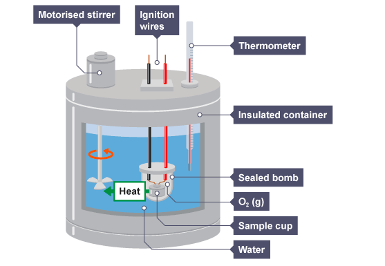
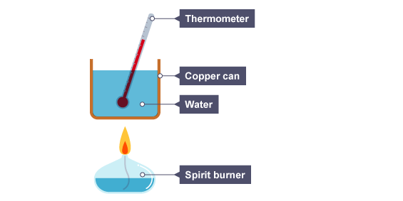
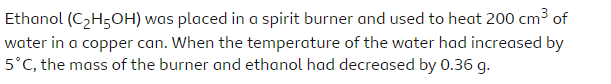
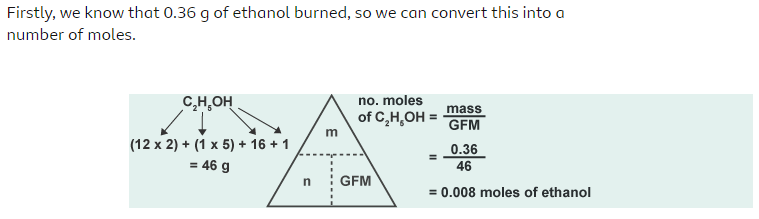
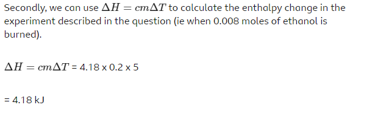
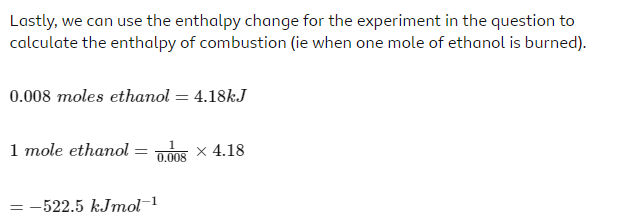
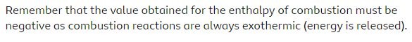

Dalam reaksi pembakaran, beberapa senyawa akan melepaskan panas lebih banyak daripada senyawa lainya. Entalpi pembakaran dapat digunakan untuk membandingkan bahan bakar mana yang melepaskan panas lebih banyak.

Instrumen untuk mengukur entalpi

atau dapat disederhanakan menjadi

Maka hal yang perlu diperhatikan seperti 
1. temperature awal air
2. temperature akhir air
3. massa pembakar sebelum percobaan
4. massa pembakar setelah pemanasan
5. perubahan suhu

Massa bahan bakar akan berhubungan dengan dengan kenaikan suhu, selanjutnya hal tersebut dapat digunakan untuk mengukur perubahan entalpi reaksi, selanjutnya hal tersebut dapat digunakan untuk mengukur entalpi pembakaran bahan bakar tersebut.

misalnya perhitungan entalpi pembakaran Ethanol 

**Jawab**

