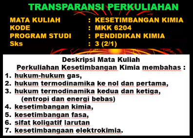
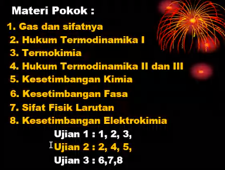
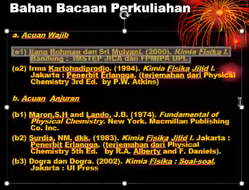
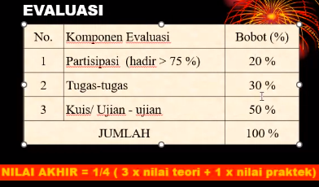

Pak heru 1-4, bu endah 5-6. 

Memahami hubungan proses fisika atau reaksi kimia terhadap energi, aplikasi termodinamika dalam kesetimbangan termasuk elektrokimia.  

Turunanan dan integral yang dipelajari dalam matematika kimia akan digunakan dalam mata kuliah kesetimbangan kimia ini. 

Pak heru mengadakan ujian dua kali yaitu Ujian 1 & 2

bisa meminjam buku tersebut di perpustakaan departemen kimia. 

