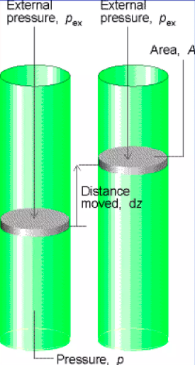

gas sebanyak 2 mol menempati ruangan yang voluemnya 2L diekspansi sampai volumenya 10L dengan temperature mula-mula 300K

1. berapa kerjanya jika diekspansi melawan P tetap sebesar 1 atm
2. bila mula mula diekspansi melawan P tetap 2 atm lalu dilanjutkan melawan 1 atm, berapa kerja totalnya
3. berapa pula kerjanya jika dilakukan secara ekspansi reversibel

> ekspansi berarti terjadi kenaikan volume

> kompresis berarti terjadi penurunan volume

> kerja ekspansi adalah kerja yang timbul karena adanya perubahan volume	

sebuah gas terperangkap oleh piston dengan gaya piston dapat didefinisiakn sebagai 
F = -P . A

- P adalah tekanan
- A adalah luas silinder

maka kerja yang diperlukan untuk menggerakkan silinder adalah 

dw = -F . dz
