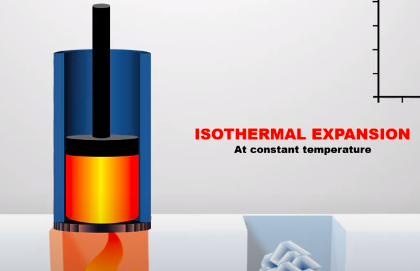
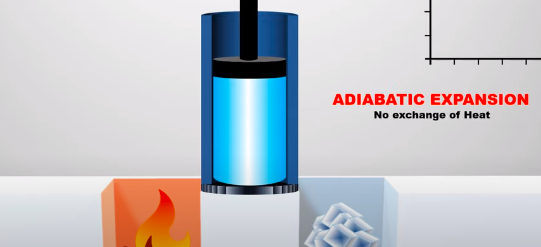
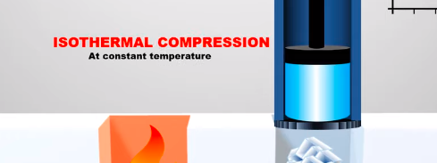
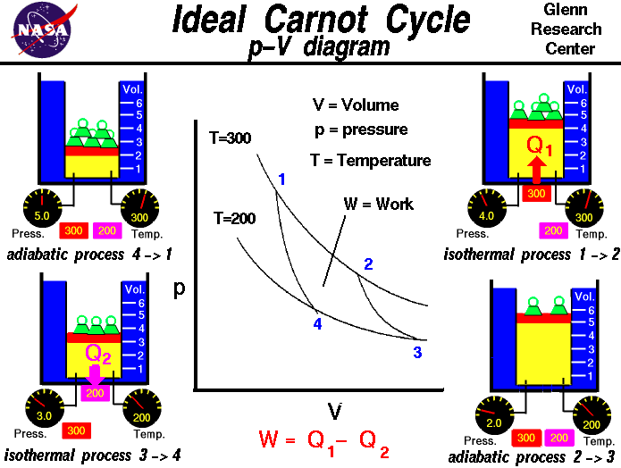

Bayangkan kamu memiliki sebuah piston yang akan ditempatkan pada tungku isolator, tungku tersebut diberikan pemanas konstan (kiri) dan pendingin konstan (kanan)

ketika piston diberi panas, gas akan mengembang mendorong piston keatas (saat terjadi pertukaran panas atau pemanasan), disebut dengan **ekspansi isotermal.** 

ketika piston dilepas dari sumber panas, gas akan mengembang mendorong puston keatas (saat sudah tidak ada pertukaran panas atau setimbang), disebut dengan ekspansi adiabatik

ketika piston diberi dingin, gas akan mengompres menarik piston kebawah (saat terjadi pertukaran panas atau pendinginan), disebut dengan **kompresi isotermal.** 

ketika piston dilepas dari sumber dingin, gas akan menarik piston kebawah (saat sudah tidak ada pertukaran panas atau setimbang), disebut dengan kompresi adiabatik

grafik mesin carnot dapat digambarkan sebagai berikut
