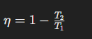
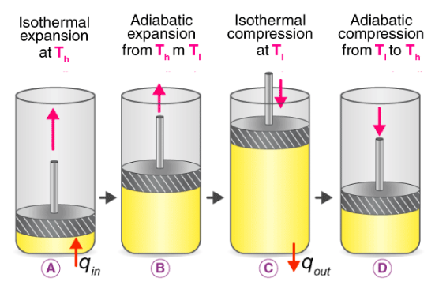

Carnot Cycle adalah sebuah hipotesis. sebuah model siklus ideal dari perubahan tekanan dan temperature pada fluida. 

konsep fundamental dalam termodinamika yang digunakan untuk menunjukkan batasan ideal dalam efisiensi mesin panas. It estimates the maximum possible efficiency that a heat engine during the conversion process of heat into work and conversely.

### Siklus carnot
sebuah siklus termodinamika tertutup ideal yang dapat dibalik. Efisiensi maksimum dari sebuah mesin panas Carnot hanya tergantung pada suhu sumber panas (T₁) dan suhu sumber dingin (T₂). Efisiensi mesin Carnot (η) didefinisikan sebagai:

> Mesin Carnot secara teoretis merupakan mesin panas terbaik yang mungkin, dan tidak mungkin untuk menciptakan mesin panas yang lebih efisien daripada mesin Carnot saat bekerja antara dua suhu tertentu

1. ekspansi isotermal
2. ekspansi adiabatik
3. kompresi isotermal
4. kompresi adiabatik

