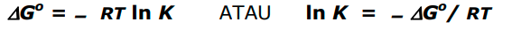
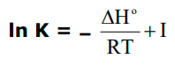
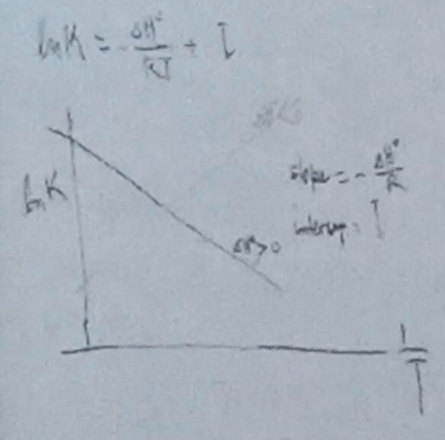

Menurunkan persamaan Gibbs-Helmoltz didapatkan persamaan

Mengintegralkan sehingga mendapat persamaan berikut dengan I atau dalam integral umumnya adalah C

dari persamaan diatas reaksi berjalan secara endotermis atau eksotermis (eksotermis: melepas panas). Apabila delta H bernilai lebih dari nol maka reaksi berjalan secara endotermis.

Dengan melihat arah plot apakah menurun atau menaik
