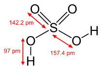
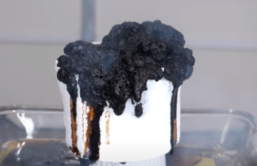
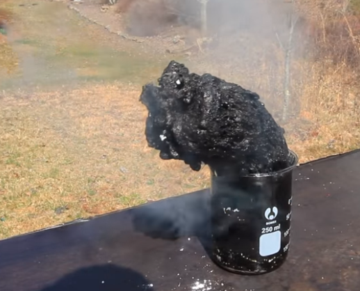

Zat ini larut dalam air pada semua perbandingan. reaksi hidrasi (pengenceran) asam sulfat sebagai berikut
H2SO4 + H2O → H3O+ + HSO4

bersifat eksotermik. Selalu tambahkan asam ke dalam air daripada air ke dalam asam. Air memilikimassa jenis yang lebih rendah daripada asam sulfat dan cenderung mengapung di atasnya, sehingga apabila air ditambahkan ke dalam asam sulfat pekat, ia akan dapat mendidih dan bereaksi dengan keras

Afinitas asam sulfat terhadap air cukuplah kuat sehinga dapat digunakan untuk mengeringkan buah-buahan. reaksi H2SO4 dengan selulosa

Selulosa bereaksi dengan asam sulfat dan menghasilkan karbon yang akan terlihat seperti efek pembakaran kertas. atau asam sulfat yang ditambahkan kedalam sesendok bubuk gula

bila terkena senyawa organik, maka asam sulfat akan menarik unsur H dan O dari senyawa tersebut dan hanya menyisakan karbon.