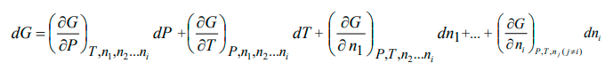
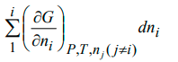
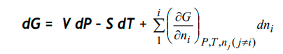
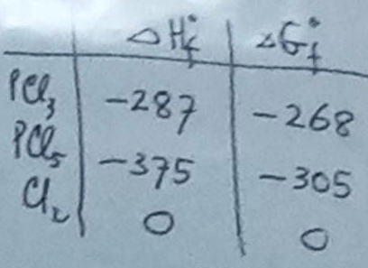
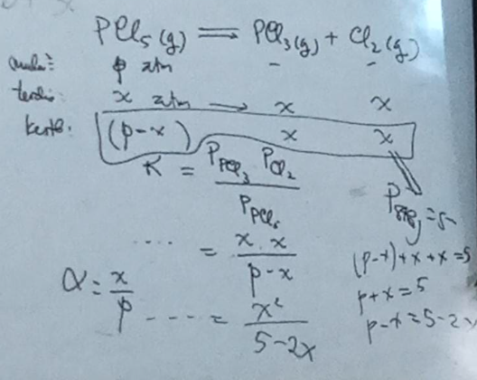

Kesetimbangan umumnya terjadi pada sistem tertutup, tetapi tidak menutup kemungkinan terjadi pada sistem terbuka. 

**G=G(P,T)** fungsi potensial terhadap tekanan dan temperature, **G=G(P,T,ni)** fungsi potensial terhadap tekanan, temperature, dan komposisi. ni ini bisa berjumlah sesuai keadaan. Perubahan energi bebas Gibbs adalah turunan daripadanya

turunan ni dapat direpresentasikan oleh

pada materi hukum termodinamika dua dikemukaan representasi V dan S sebagai berikut

maka persamaan dapat ditulis ulang sebagai

potensial kimia adalah energi bebas gibbs molar

> massa molar adalah massa satu mol suatu atom

Keberlangsungan reaksi kimia dapat diramal dari delta ∇G0 yang merupakan -RT ln K, dimana K adalah tetapan kesetimbangan termodinamila. dalam koteks fasa gas, maka K dianggap sebagai keseimbangan tekanan. 

> fasa cair, padat memilki tetapan K yang berbeda beda. tetapan K pada gas sering juga disebut dengan Kp karena merupakan representasi dari keseimbangan tekanan

misalnya, reaksi `PCl5 -> PCl3 + Cl2`. melihat tabel berikut informasi delta G dan delta H pembentukan (f: formation)

maka delta G dan delta H reaksi dapat dihitung melalui `delta H reaksi = (delta Hf PCl3 + delta Hf Cl2)-(delta Hf PCl5)` cara tersebut juga dapat dihitung untuk delta G. nilai tersebut dapat digunakan untuk mengetahui nilai K (atau Kp dalam konteks gas)

delta G0 = -RT ln K

> perhatikan satuan dari setiap variabel

apabila tekanan total gas adalah 5 atm, maka derajat disosiasi dapat diprediksi.

> Proses disosiasi dapat terjadi ketika energi termal cukup untuk memecah ikatan kimia. misal, H2O (air) dalam fase gas pada suhu yang sangat tinggi, beberapa molekul dapat terurai menjadi atom hidrogen (H) dan atom oksigen (O) yang terpisah.

kemudian substitusi Kp yang telah diketahui kedalam persamaan untuk mengetahui nilai X (derajat disosiasi) `Kp = (X.X)/(5-2X)`

