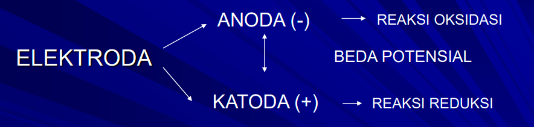
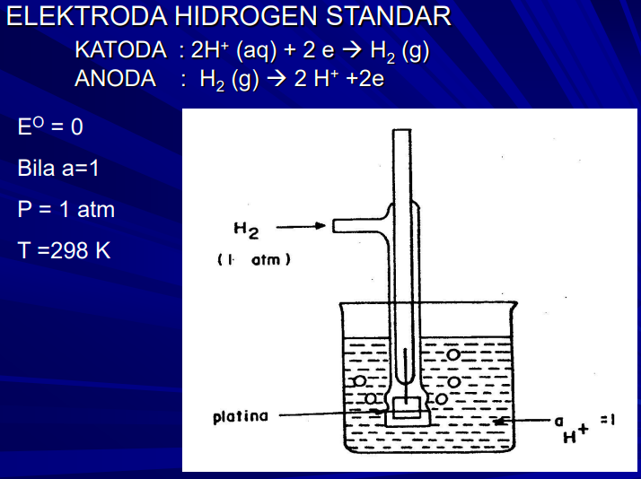
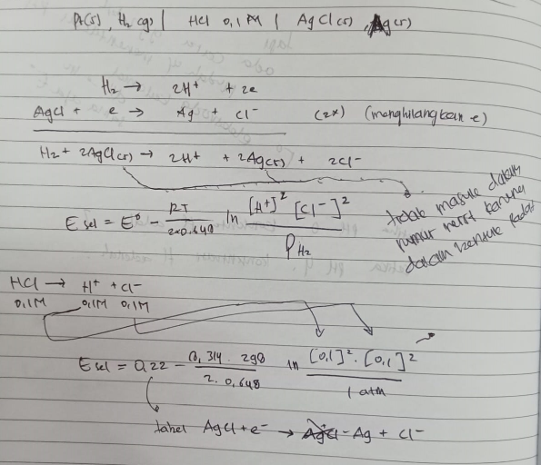
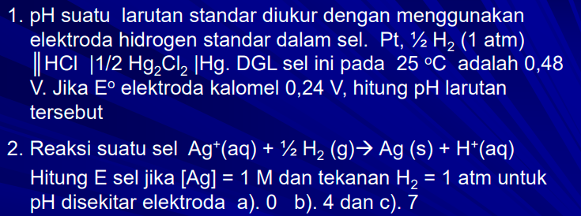
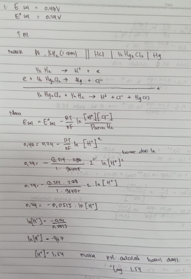
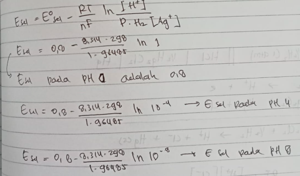
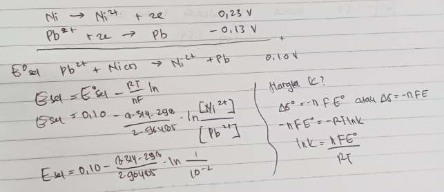
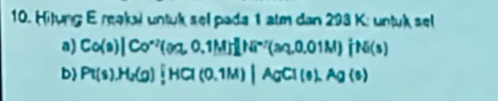
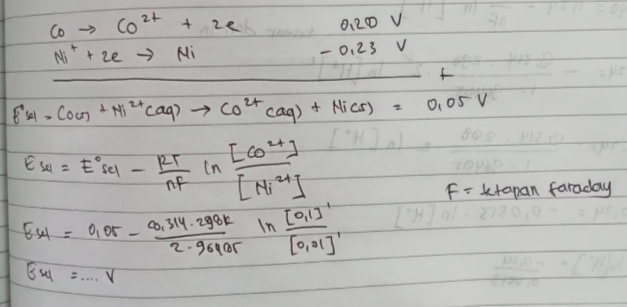

Mempelajari semua reaksi kimia yang menghasilkan energi listrik dan menerapkan kesetimbangan elektrokimia.

sel elektrokimia adalah sistem yang terdiri dari dua elektroda terpisah minimal oleh satu macam fasa elektrolit. 

oksidator: bilangan oksidasi turun, unsur mengalami reduksi.
reduktor: bilangan oksidasi naik, unsur mengalami oksidasi.

misalnya cu, mengalami reduksi, berperan sebagai oksidator. 

fungsi jembatan garam seperti: menstabilkan muatan, 

Ni(s) | Zn 2+ 
oksidasi 

 AgCl (s) + e => Cl- (aq) | Ag
reduksi

yang menempel di anion, adalah negatif

elektroda pertama adalah elektroda hidrogen. 

Elektroda kaca dipakai di yang dicelupkan biasa di pakai di laboratorium UNY. 

Elektroda Hidrogen bernilai E0 adalah 0. INI ADALAH PERJANJIAN, maka penentuan E0 lain diukur berdasarkan patakona ini. 

## Pengukuran Potensial
Potensial Elektroda Standar E0 volt. 

> dalam tabel beda potensial

E0 berharga positif, artinya itu bisa berlangsung
E0 berharga negatif, artinya ...

ini juga mengindikatorkan kereaktifkan. semakin besar nilainya, maka semakin reaktif seperti natrium, ketika diletakkan di tempat terbuka akan mudah bereaksi. 

misalnya seperti Na, biasanya disimpan dalam minyak tanah. berbeda dengan minyak goreng itu bisa teroksidasi, sehinga berbau tengik, sehingga untuk mengawetkan adalah dengan cara divakum sehingga dapat bertahan lama. 

> pada dasarnya bakteri dapat berkembang melalui oksigen. 

## Persamaan Nerts

$$ E sel = E^{0} sel \frac{RT}{nF} ln  \frac{[unsur kanan]^{koefisien}}{[unsur kiri]^{koefisien}} $$

supaya berlangsung, E sel harus lebih dari nol. dimana E0 adalah E dalam tabel potensial. 

	 n adalah mol
	 F adalah konstanta faraday
	 
Misalnya:
Hitung E reaksi untuk sel pada 1 atm dan 298K

nomor 1

*ln dapat diubah ke log, (dimana log adalah prinsip pH) tetapi ada cara yang lebih mudah untuk mengubah ln ke pH dalam kasus ini.* 

*pH adalah definisi dari konsentrasi H+, maka ini dapat dikaitkan ketika ln[H+] itu berapa*

