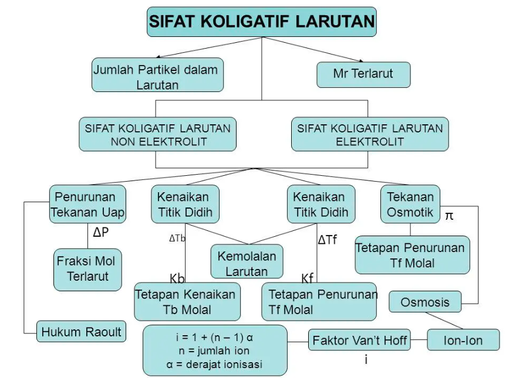
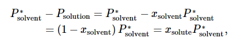

*peta konsep*

Misalnya ketika H2O dicampur dengan NaCl maka titik didih larutan akan naik. Ion Na dan Ca akan mengganggu jaringan air, membuat lebih sulit bagi molekul air untuk bergerak dan menguap.

> ### Sifat koligatif adalah sifar larutan yang bergantung pada jumlah partikel dalam larutan dan bukan pada jenis spesimen. 

sifat koligatif bergantung pada rasio jumlah partikel pelarut dengan terlarut. rasion ini dapat dinyatakan dalam 

- fraksi mol
- molaritas, (m), umumnya ini dipakai dalam koligatif 
- normalitas

$$ m = \frac{n_{terlarut}}{n_{pelarut}} $$

Secara fisik, bebera partikel terlarut digantikan oleh partikel pelarut dalam fasa cair.

## Penurunan tekanan gas
tekanan dari gas ideal mengikuti hukum Raolt's.

dari persamaan dapat diartikan tekanan uap hanya bergantung pada konsentrasi terlarut. 