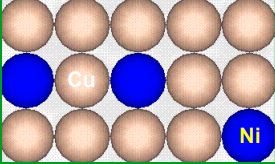
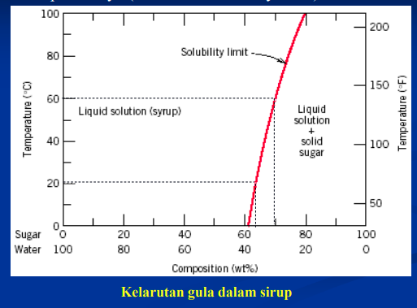
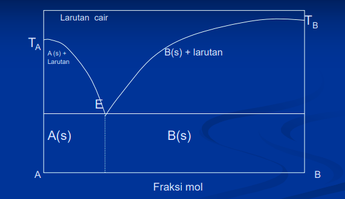
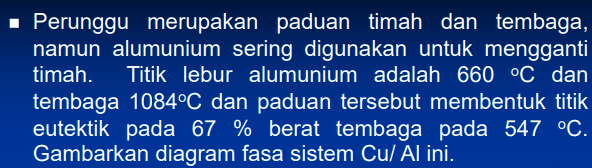
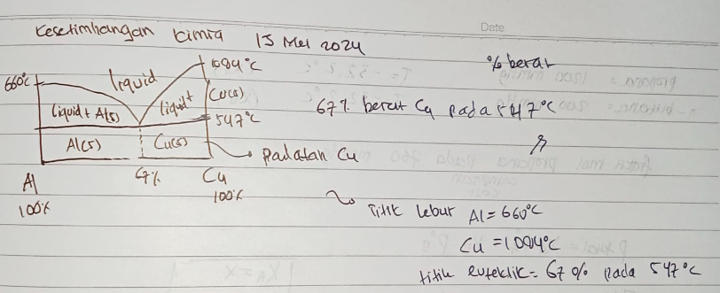
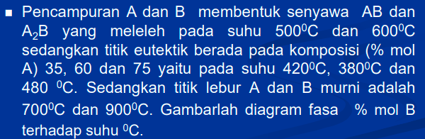
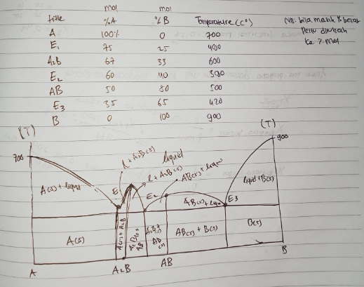
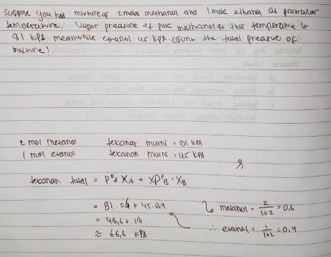
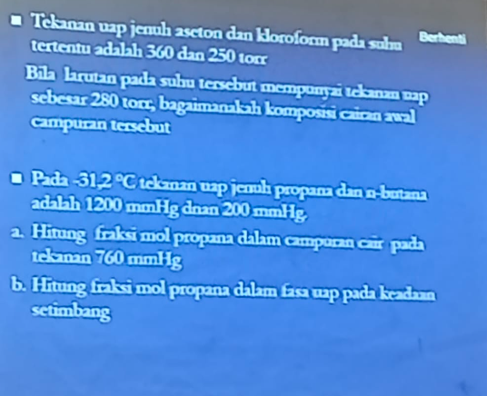
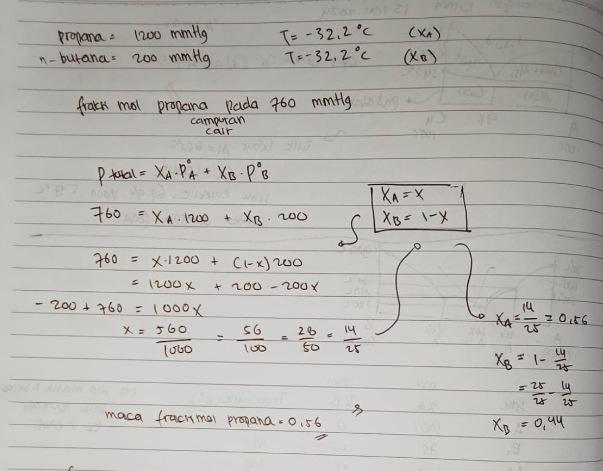

Pemaduan terjadi akibat adanya susunan atom sejenis ataupun ada distribusi atom yang lain pada susunan atom lainya.

Pembentukan diagram fasa menggambarkan hubungan temperature dengan waktu. ada juga yang menghubungkan hubungan antara temperature dengan persen berat. 

dibagian kanan (sebelah kanan garis merah) sudah mendapati jenuh, sehingga terdapat padatan gula yang tidak larut. diatas dengan pemanasan maka dapat meningkatkan tingkat kelarutan. 

!
karakteristik khusus titik E yaitu memiliki sifat yang berbeda. misalnya seperi Cu Ni Fe (Baja). disebut dengan Euteknik, yaitu suhu terendah dimana masih mendapatkan bentuk cair. titik tersebut digunakan oleh pengrajin patung untuk mempermudah pembentukan bentuk. 

fraksimol bentuk gas

nomor 1 cara menghitungnya sama seperti pada cara a nomor 2

Karbol, itu ketika ditaruh di air suhu kamar maka warnanya akan putih atau keruh, tetapi ketika ditaruh pada air dengan suhu yang tinggi akan benng, yang menandakan menyatu menjadi satu fasa. 

bahan kimia yang tidak dapat dipanasi karena akan terdekomposisi, maka perlu dilarutkan, untuk manipulasi. 

