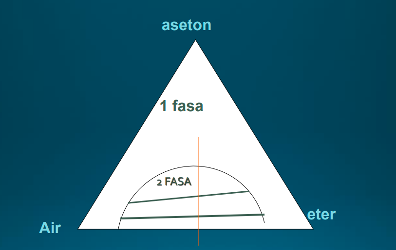
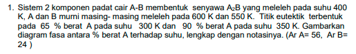
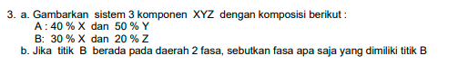

Sebernya ini bisa dibuat model kecerdasan buatan untuk menentukan. 

Fasa = C - P
Fasa = 3 - P

> c untuk component

daerah 2 fasa, fasa pertama adalah air-aseton dan eter-aseton (eseton disini sebagai pelarut) sedangkan air-aseton tidak mungkin karena tidak dapat larut. terdapat dua garis, itu adalah garis dasi dimana percobaan dilakukan untuk memproyeksikan setengah lingkaran. 

daerah 1 fasa, antara air, aseton, dan eter becampur dengan baik, 

> A2B tidak tahu %berat nya tetapi tahu persen mol dengan menghitung koefisien pada rumus senyawa. maka perlu diselaraskan apakah dengan persen berat atau persen mol. 

mengubah persen berat ke persen mol dan sebaliknya terdapat pada foto berikut, dan cara mengerjakan soal diatas. 

yang nomor b tidak dapat dikerjakna, ditulis diatas, atau pertanyaan tidak dapat dijawab karena tidak dijelaskan mana yang bersifat pelarut 

Jawaban, ini tentang destilasi ges, semoga bermanfaat. 

dibawah ini adalah menunjukkan pada suhu tertentu saja terjadi satu fasa, selebihnya dapat kembali ke dua fasa

