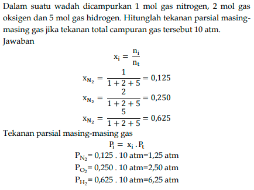

Presuere (P)

$$ n = \frac{n_i}{n_t} $$

dimana ni adalah senyawa yang dimaksud, dan nt adalah total. Dalton mengemukakan bahwa tekanan total yang ditimbulkan oleh campuran gas merupakan jumlah tekanan yang ditimbulkan dari masing masing jenis gas. 
