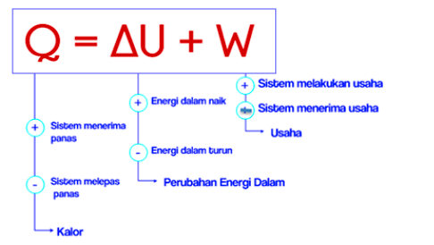

## Proses adiabatik
terjadi ketika satu-satunya energi yang ditransfer ke atau dari suatu sistem melalui kerja yang dilakukan pada atau oleh sistem. Energi ditransfer ke luar untuk gas melakukan kerja dan energi ditransfer ke dalam gas ketika kerja eksternal dilakukan padanya.

## Proses isobarik
terjadi ketika tekanan gas dalam suatu sistem konstan. Seringkali, reaksi kimia berlangsung pada tekanan konstan, menjadikannya proses isobarik

## Proses isokhorik 
terjadi ketika volume gas dalam sistem termodinamika konstan. Gas yang dibakar di mesin mobil adalah contoh proses isokhorik yang baik. Gas-gas ini biasanya berubah suhu dan tekanannya tetapi volumenya tetap.

## Proses isotermal
sesuai pola ini, pada gilirannya akan menjadi sistem yang suhu gasnya konstan. Es yang mencair tetap berada pada suhu konstan dan merupakan contoh proses isotermal.

```∆U = w + q``` 

∆U adalah perubahan energi, w adalah kerja, dan q adalah panas. 

Persamaan diatas merupakan manifestasi dari percobaan jamer joule, sehingga satuan energi ditetapkan dengan naman joule. 

*A major task for designers of any machine that converts energy to work is to maximize the amount of work obtained and minimize the amount of energy released to the environment as heat*

dari pernyataan diatas dapat dikatakan bahwa panas adalah salah satu bentuk kerugian penyebab efisiensi mesin tidak maksimal. 

- ΔU bertanda positif (+) jika sistem mengalami kenaikan suhu dan sebaliknya
- Q bertanda positif (+) jika sistem menyerap kalor dan sebaliknya
- W bertanda positif (+) jika sistem melakukan usaha sebaliknya 




> U stand for universal, karena (ΔQ – ΔW) selalu konstan
