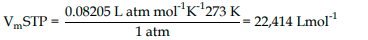
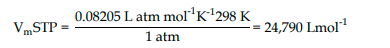

volume yang ditempati per 1 mol molekul gas. atau dengan kata lain 1 mol molekul gas menempati berapa liter volume

$$ V_m = \frac{RT}{P} $$

ditetapkan dua keadaan yaitu volume molar pada temperature dan tekanan standar (STP) dan temperature dan tekanan kamar standar (STAP). 

## STP
T = 273 K
P = 1 atm

## STAP
T = 298 K
P = 1 atm

