Obat bisa berupak tanaman yang dibagi menjadi daun akar. akar yang kemudian dibuat menjadi jamu. 

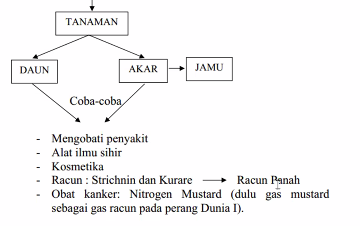

dioleskan ke panah berupa strichin dan kurare. akan masuk ke hewan racunya tadi sehingga hewanya kejang-kejang. 

Gas mustard itu digunakan pada PD I dengan efeknya memberikan kanker. tetapi ketika sulfurnya diganti dengan nitrogen, maka dapat digunakan untuk mengobati kanker. pengaruh adanya struktur itu bisa mengubah efek yang ditimbulkan. mencari struktur yang mirip, tetapi akan memberikan efek antagonis (berlawanan) atau sinergis. 

Tanaman dapat dibuat dengan rebusan atau dengan ekstrak sehingga dari cara kedua atau salah satunya akan didapatkan isolasi zat aktif. 

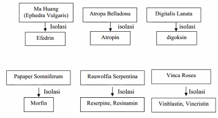

contoh bagaimana obat didapatkan

dari tanaman salix alba, atau bisa langsung dengan jalan sintesis. penislin ditemukan ditahun 40. 

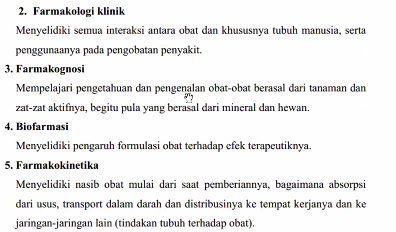

farmakodinamik : mempelajari kegiatan obat terhadap organisme hidup, terutama cara dan mekanisme kerjanya, reaksi fisiologis serta efek terapeutik yang ditimbulkanya. 

Toksikologi : pengetahuan tentang efek racun terhadap tubuh

Farmakoterapi : mempelajari penggunaan obat untuk mengobati penyakit atau gejala - gejalanya. 

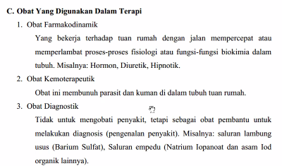
obat farmakodinamik : obat yang melancarkan buang air kecil namanya Diuretik, ini masuk kedalam golongan obat farmakodinamuk yaitu mempercepat atau memperlambat fisiologi dan fungsi biokimia dalam tubuh. contoh lain adalah obat untuk mempercepat tidur.

obat kemoterapeutik : membunuh parasit dan kuman didalam tubuh tuan rumah. 

obat diagnostik : tidak untuk mengobati penyakit, tetapi sebagai obat pembantu untuk melakukan diagnostik. misalnya pada saluran usus maka digunakan Barium Sulfat, ini akan mengalir ke usus, sehingga orangnya masuk ke suatu alat dan memotret sehingga barium sulfat akan terpotret, maka disitulah penyumbatanya. 

### Farmakope
semua negara mempunyai farmakope nya masing-masing. farmakope belanda isinya ada formula juga. nama kimia dan bahan aktif ternyata berbeda seperti dibawah ini
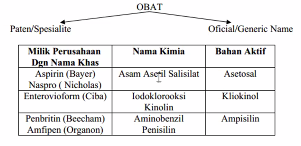

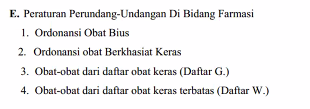

efek seistemik adalah efek yang bekerja pada seluruh tubuh. misalnya obat oral yang beredar ke seluruh tubuh : lazim, praktis, mudan dan aman. kecuali dibawah ini diberikan secara oral 
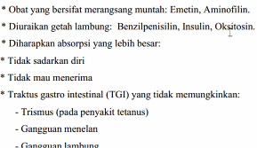

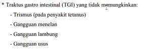

obat dibawa oleh darah beredar keseluruh tubuh, kalau diharapkan absorbsi besar, maka jika dimasukkan kedalam lambung maka akan bertemu dengan berbagai jenis makanan. agar cepat maka diberikan secara infus (injeksi). 

## Injeksi 
jika dibutuhkan pengaruh obat yang cepat. jika tidak boleh inkobilitas (campur) maka bisa mengguakan metod injeksi, sehingga tidak tercampur dalam pencernaan misalnya. 

misalnya erytromycin akan rusak dengan zat-zat makanan, maka menggunakan metode injeksi, contoh lainya dijabarkan dibawah ini
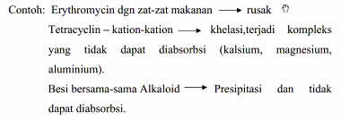

Besi dengan alkaloid seperti teh, akan presipitasi dan tidak dapat diabsorbsi. contoh lain dari teh adalah kopi. keuntungan dari injeksi 
1. efek cepat, kuat dan lengkap
2. obat yang merangsang tidak diabsorbsi usus 
3. dapat diberikan ketika pasien tidak sadar dengan kata lain merupakan alternatif jika pasien tidak mau bekerja sama.  

sedangkan kerugianya antara lain mahal, nyeri dan merusak pembuluh (syaraf) bila tidak tepat. 
jenis-jenis injeksi
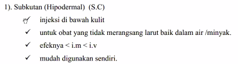
(dibawah kulit)
efeknya lebih kecil dari intramuskular (i.m). intramuskular adalah dibawah otot seperti di pantat. i. v adalah singkatan dari intravena. jika intravena itu akan langsung masuk ke pembuluh darah. 

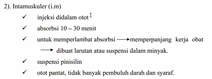

injeksi berbentuk cairan, dan bisa dibuat suspensi (campuran cair dan padat) atau berbentu emulsi (campuran air dan minyak) diinjeksikan ke pantat yang tidak banyak pembuluh darahnya. 

injeksi intravena memiliki efek yang paling cepat karena obat pada dasarnya didistribusikan oleh darah. 

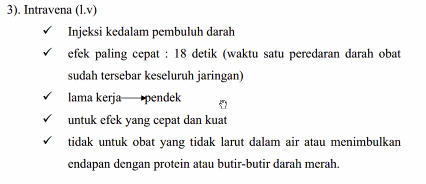

intravena harus berupa obat yang benar benar bisa larut, agar tidak terjadi penyumbatan di darah. karena dianggap benda asing oleh darah, maka bisa saja tekanan darahnya mendadak rendah, shock dsb. sebenarnya infus itu menyesuaikan dengan detak jantung. 

jenis injeksi lainya
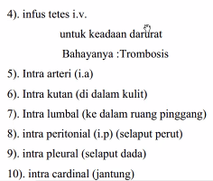

## sublingual
obat yang dikunyah yang ditaruh dibawah lidah
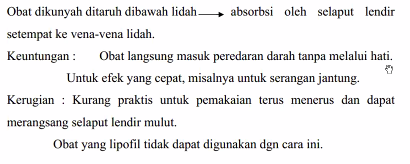

obat sublingual lebih cepat daripada obat peroral, ada kasus orang yang tidak terlolong karena salah mengonsumsi obat bukan sublingual. sublingual memang dibuat dapat larut dalam air liur. 

## implantasi subkutal

misalnya adalah susuk KB. dia akan terabsorbsi sedikit demi sedikit. 

## rektal
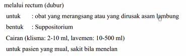

## Efek lokal
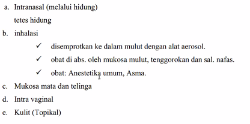

diatas akan memberikan efek lokal. 