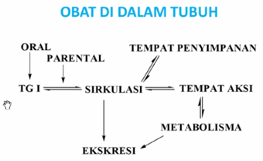

obat masuk kedalam sirkulasi dan sampai ke temapt aksi. receptor adalah tempat titik aksi didalam tubuh. 

zat yang menyebabkan sakit akan menempel ke reseptor, jika sudah flip, maka efek rasa sakit akan terasa. 

prostalgadin, keluar ketika membran ada yang rusak. zat itulah yang menyababkan rasa nyeri. 

antiinflamasi atau analgetik akan berinterasi dengan COx. intermediate penyebab nyeri (prostalgadin). prostalgadin akan masuk kedalam reseptor nyeri. 

maka perlu menyari molekul yang bisa masuk ke reseptor, agar prostalgadin tidak dapat masuk kedalam reseptor. 

>amilum + amilosa = maltosa
(enzim dan substract) itu seperti itu dalam penambatan molekul, tetapi itu bukan enzim-substract sepertinya. 

atau dengan cara lain, yaitu dengan memblok produksi prostagladin. (golongan obat steroid antiinflamasi (SAID))

atau dengan cara lain, yaitu blokir produksi di asam melanomat. (golongan obat steroid non antiinflamasi (NSAID))

orang yang sering menggunakan SAID, maka efek samping adalah moonface

**NSAID (Nonsteroidal Anti-Inflammatory Drugs)** bekerja dengan menghambat enzim COX (Cyclooxygenase) yang menghasilkan prostaglandin yang menyebabkan peradangan, nyeri, dan demam.

sedangkan
**Steroid antiinflamasi** bekerja dengan menekan sistem kekebalan tubuh dan meredakan peradangan melalui efek yang berbeda pada berbagai jenis sel di tubuh.

mukosa lambung dapat hilang kalau keseringan minum antipiretik. apalagi asam mefenamat akan sangat memberi sakit pada lambung. 

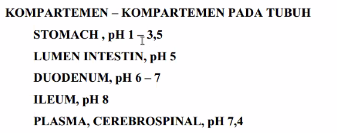

Lambung memiliki pH masing masing pada setiap bagianya. 

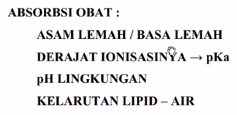

asam lemah atau basa lemah akan berhubungan dengan pKa. pH lingkungan adalah pH yang berada pada misal lambung. kelarutan lipid-air berhubungan dengan koefisien partisi. ( angka yang menyatakan kelarutan pada fase organik dan fasa air (non polar dan polar)) sehingga dapat diketahui berapa yang masuk ke organik berapa yang masuk ke non polar. apabila nilai koefisien tinggi maka dia kebanyakan larut dalam fasa organik (LIPID) itu berarti adalah lipofil. 

obat ukuran adalah pKa, kelarutan dalam lipid adala koefisien pelarut partisi. 

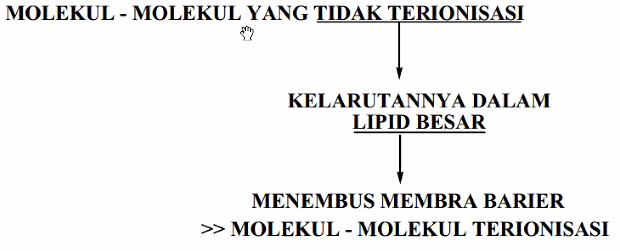

molekul yang tidak terionisasi dalam maka ia larut dalam lipid sehingga dapat menembus membran barier. 

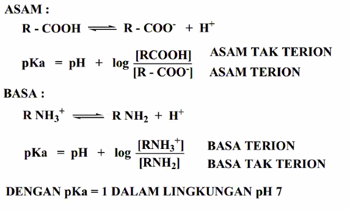

1. **nasib obat bila bersifat asam (lemah)**, RCOOH (bentuk molekul) dan R-COOH - (adalah bentuk ionya). R-COOH itu representasi dari obat yang akan dihitung
2.   **nasib obat bila bersifat basa (lemah)** pH adalah miliknya lingkungan, dan pka adalah miliknya obat. pH lingkungan dapat diketahui, pka obat dapat diketahui. maka dari rumus akan ketemu adalah **konsentrasi perbandingan bentuk ion dan tak terion**
hal tersebut digunakan dalam pengetahuan bahwa kalau ia bentuk dalam molekul (tidak terionisasi) maka akan lebih mudah menembus membran. 

#### Pertanyaan
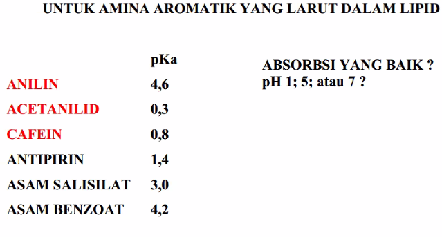

misal pH 7 (lingkungan) dan pka 1 (obat), yang terjadi adalah 

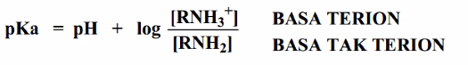

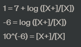

ini menunjukkan bahwa rasio [X+]/[X] sama dengan 10 pangkat -6, atau [X+]/[X] = 0,000001. Oleh karena itu, basa terionisasi hanya ada dalam jumlah kecil, yaitu hanya sekitar 1 dari setiap 1.000.000 molekul basa, sementara sisanya dalam bentuk basa tak terionisasi.

Jadi, rasio [X+]/[X] adalah sekitar 1:1.000.000 atau 10^(-6). Ini berarti hanya sekitar 1 dari setiap 1.000.000 molekul basa yang akan terionisasi dalam lingkungan dengan pH 7 dan pKa 1. Jumlah basa terionisasi ini akan meningkat ketika pH lingkungan lebih rendah dari pKa atau ketika konsentrasi basa terionisasi lebih tinggi.

contoh lain (by chatGPT uhuy)
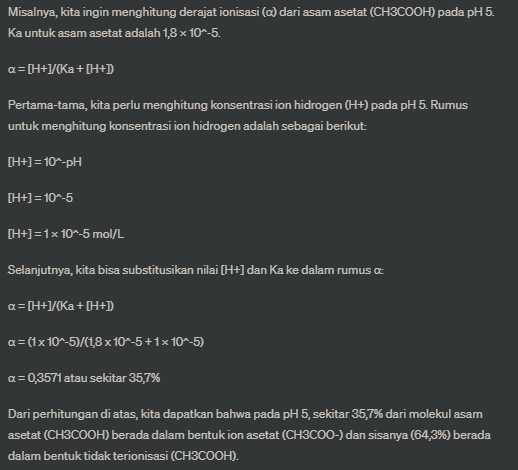

kesimpulan yang dapat diambil dari soal screenshot adalah pH 7 adalah kondisi obat dapat terabsorpsi paling mudah diabsorpsi diantara variasi pH 5 dan 1. 

membran barrier
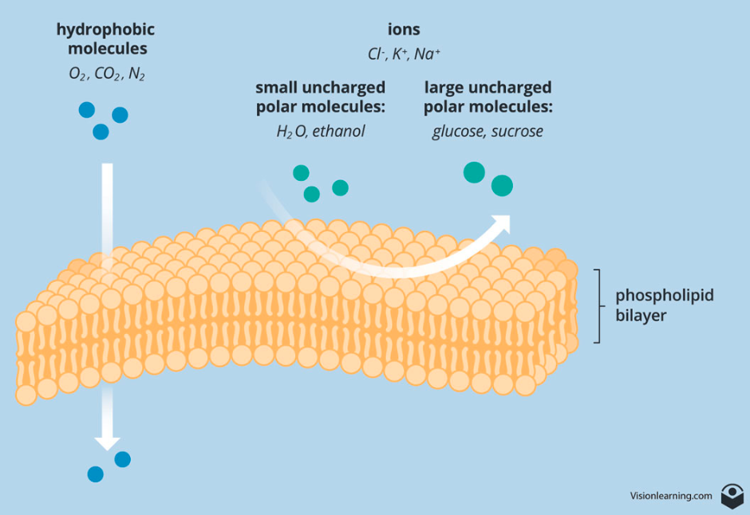

JADIIIIII
kalau obat di lambung dan diketahui pH lambung adalah 2, maka obat akan sulit diabsorpsi (dalam cell).
kalau obat di plasma dan diketahui pH nya lebih tinggi dari 5 (misal) maka obat tersebut akan lebih mudah di absorpsi di plasms (dalam cell).

yang bisa dimodifikasi dari obat adalah pKa dan koefisien partisinya. 

TUGAS
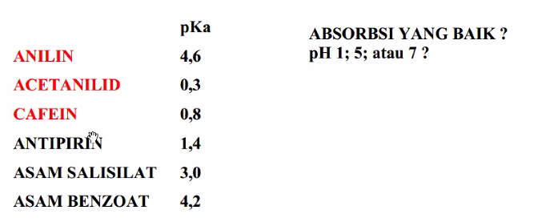
yang merah bersifat basa (lemah) dan yang hitam bersifat asam (lemah)
jadi totalnya adalah 6 x 3. 
*dikumpulkan paling lambat minggu depan. *