Farmakokinetik : Nasib obat didalam tubuh

ADME : Absorbsi, Transportasi, Distribusi, Biotransformasi (Metabolisme), Ekstresi.

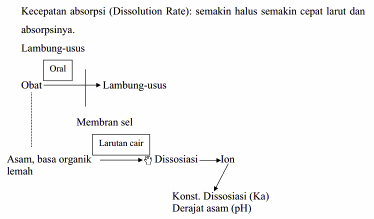
(obat bersifat asam, basa organik lemah)

obat yang berbentuk molekul lebih mudah diabsorpsi daripada obat dalam bentuk ion
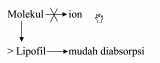
karena bentuk molekul adalah lebih lipofil daripada bentuk ion. 

## Biotransformasi
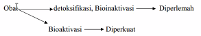

obat mengalami bioinaktivasi (menjadi kurang aktif) dalam istilah obat. detoksifikasi (dalam toksikologi) dalam istilah racun akan berkurang. maka apabila bioaktivasi adalah kebalikanya. 

kecepatan biotransformasi dipengaruhi oleh
1. konsentrasi
2. fungsi hati
3. usia
4. genetik
5. pemakaian obat lain: induksi enzim, inhibisi enzim. 

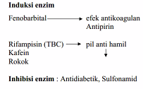

Rifampisin (obat TBC) sifatnya memacu (induksi enzim) sehingga enzimnya menjadi banyak. ketika enzim menjadi banyak, maka terjadi peningkatan metabolisme obat oleh enzim. maka mengurangi efektivitas obat karena obat tersebut tidak dapat bertahan dalam tubuh dalam jangka waktu yang cukup untuk mencapai konsentrasi terapeutik yang tepat. maka dosis untuk mencegah hamil tidak tepat.

atau dengan kata lain, dosis untuk mencegah kehamilan menjadi berkurang (tidak tepat). misalnya dokter tidak tahu kalau pasien TBC sedang pil KB, maka kemungkinan efektifitas pil KB akan berkurang. 

inhibisi
berarti enzim yang memetabolisir mejadi kurang, maka ini bisa terjadi overdoses

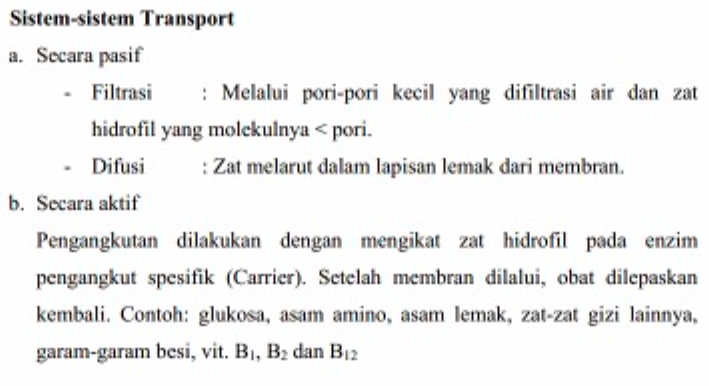

### Distribusi
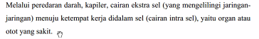

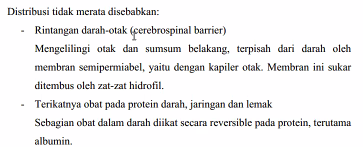

tidak semua mudah untuk menembus ke otak (dihalangi cerebrospinal barrier).  selain diatas ada persentase pengikatan (PP)

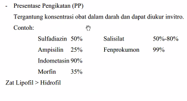

sulfadiazin 50% terikata pada protein, jaringan atau lemak, dan 50% dia bebas, yang bebas itu yang aktif (yang memberikan efek)

misal lagi ampisilin, yang terikat 25% maka yang bebas adalah 75%.

indometasin itu seperti paracetamol, oleh karena itu paracetamol kebanyakan dosis adalah 500 mg. ada lagi 99% untuk fenprokumon. maka desain obat sudah diukur

zat lipofil adalah lebih terikat daripada hidrofil. terikat pada lemak sangat kuat, DDT itu. maka itu akan sampai kemana-kama, ke air susu, ke mana2 tidak termetabolisir.

obat dengan PP lebih dari 50% maka dia akan mendesak obat lain (terikat pada dudukan yang diduduki obat lain) akibatnya obat lain akan menjadi lebih banyak. misalnya obat salisilat dan fenprokumon, maka obat aktif fenprokumon akan meningkat. 

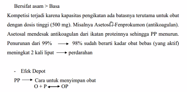

fenprokumon biasanya untuk orang-orang yang terjadi penggumpalan di jantung, agar darahnya lancar. misalnya minum asetosal dan terjadi luka maka terjadi pendarahan (encer) deras.

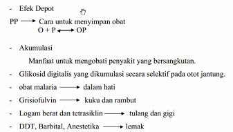

efek depot adalah efek untuk menyimpan obat. terikat di tubuh, harapanya jika dibutuhkan akan dilepaskan ketika dibutuhkan. akibatnya akan terjadi akumulasi.
misalnya obat glikosid digitalis yang dikumulasi secara selektif pada otot jantung. akumulasi ada yang menguntungkan ada yang tidak.

glikosida itu menguntungkan, jika ada serangan jantung, maka akan lepas. yang obat malaria juga menguntungkan. yang obat grisiofulvin juga menguntungkan mereka akan lepas jika penyakitnya muncul lagi. 

grisiofulvin itu untuk mencegah jamur. 

DDT, Barbital, Anestetika itu merugikan --> terikat kuat pada lemak.

apabila terlalu banyak yang terikat (akumulasi) dari batas ambang, maka ia akan terlepas dan bisa berbahaya. 

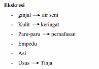

## konsentrasi plasma
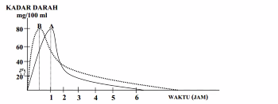

itu menunjukkan kadar obat dalam darah yang dalam waktu semakin lama semakin terabsorbsi. itu adalah representasi dari obat A dan obat B yang berbeda pola arbsopsinya.
obat B lebih cepat terabsopsi daripada obat A.

jika ekreksi. obat B lebih kema yaitu lebih dari 6 jam. sedangkan obat A  lebih cepat ter ekstreksi yaitu pada waktu 6 jam pas.
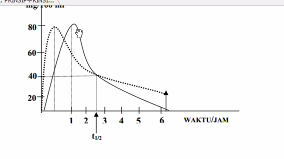
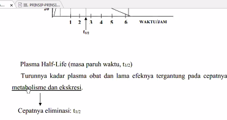

minum obat lagi agar tidak turun kadarnya. itulah asalanya bervariasi empat kali sehari, atau lainya, agar supaya ketika turun tidak jadi agar naik lagi, sehingga obat akan stabil dalam kadar darah

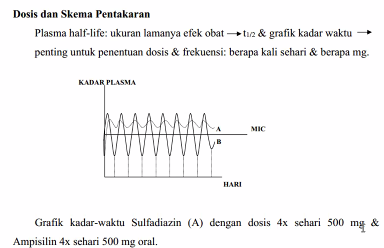

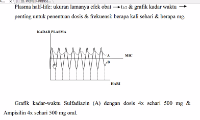

sehinga memperoleh
minimum inhibit concentration(MIC)
jika tidak teratur, maka tidak teratur kadarnya dalam darahnya.

jika di double, itu lebih berbahaya, jika diatas ada lethal dose (Ld) jika tersentuh maka bisa melampaui dosis tersebut. maka itu tidak boleh yaa, yaudah klo kelewat gausah di double.

buatlah grafik kenapa minumnya harus 2x sehari / 4x sehari. 