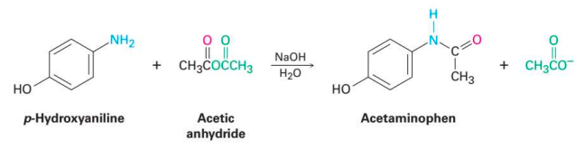
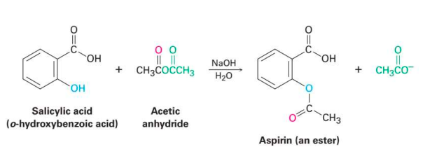

Aspirin atau asam asetilsalisilat. sering digunakan sebagai analgesik, antipiretik, dan anti-inflamasi.

*acetaminohen (paracemol)*

*aspirin*

penggunaaan anhidrida asetat sebagai agen asetilasi. anhidrida asetat akan membantu menggantikan gugus hidroksil pada asam salisilat dengan gugus asetil (-COCH₃) (reaksi asetilasi.)

***

**BAB I Pendahuluan**
1. Latar Belakang
2. Rumusan Masalah
3. Tujuan

**BAB II Isi**
1. Alat dan Bahan
2. Metode

**BAB III Penutup**
1. Kesimpulan

**Daftar Pustaka**
[*](https://chem.libretexts.org/Ancillary_Materials/Laboratory_Experiments/Wet_Lab_Experiments/Organic_Chemistry_Labs/Experiments/1%3A__Synthesis_of_Aspirin_(Experiment))
[*diktat sintesis aspirin](https://laney.edu/cheli-fossum/wp-content/uploads/sites/210/2012/01/8-Synthesis-of-Aspirin.pdf)
[*diktat sintesis aspirin.v2](http://www.chem.latech.edu/~deddy/chem104/104Aspirin.htm)
[*](https://byjus.com/chemistry/acetylsalicylic-acid/)
[*](http://www.chem.latech.edu/~deddy/chem104/104Aspirin.htm)
[*aspirin from phenol](https://www.aspirin-foundation.com/history/chemistry/)