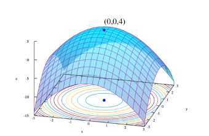
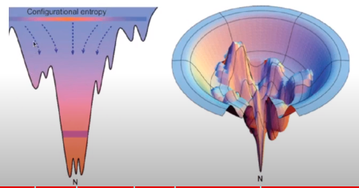
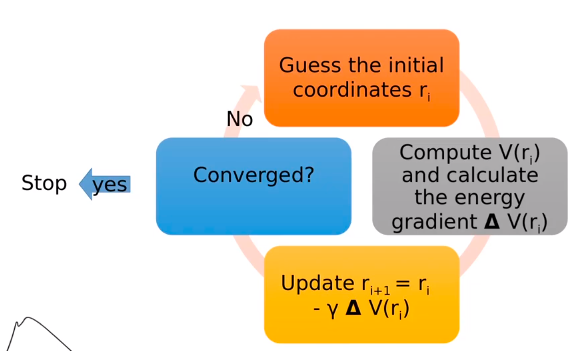

the enery held by an object because of its position relative to other objects, stresses within itself, its electric chareg, or other factor. 

energi potensial adalah energu yang terkandung dalam sistem atau objek. energi memiliki potensial untuk memiliki kerja ketika dikeluarkan

## Potential Energy Surface (PES)

ilustrasi untuk energi potensial diatomic molekul yang sangat simpel. tetapi untuk molekul seperti protein akan sangat-sangat komplek, anda perlu mempertimbangkan seperti elektrostatik, ikatan hidrogen, hidrophobik, dan lainya. seperti pada gambar dibawah ini:

> there is interesting, ada global minimal yang memiliki nilai energi hampir sama thats means, you can synthesis konformasi protein yang berbeda-beda

how algorithm work?
