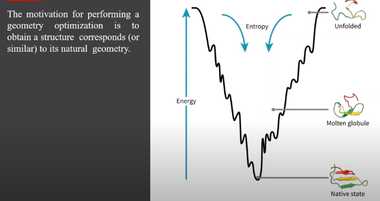
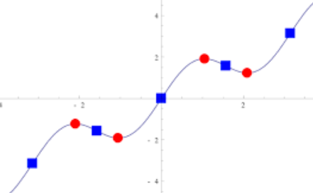

Konformasi energi adalah jumlah semua panjang ikatan dan sudut yang memberikan energi sterik terkecil. Tujuan dari mekanika molekul adalah menentukan energi konformasi terendah dari molekul. Proses ini dinamakan dengan energi minimisasi. Mengetahui konformasi stabil dari molekul adalah penting karena memberikan pemahaman tentang sifat dan perilaku berdasarkan struktur tersebut. karena molekul yang berada di alam adalah dalam keadaan energi seminimal mungkin. 

keadaan molten globule adalah ketika anda mencoba mengkristalkan protein melalui x-ray yang membuat energi molekul naik. 

untuk mengetahui nilai energi, kalkulus digunakan dalam bidang ini ketika berada pada titik stasioner akan ditandai dengan nilai 0 (titik bewarna merah), alat tersebut juga dapat digunakan untuk mengetahui apakah berada pada posisi minima atau maxima.

dalam praktiknya, molekul tersusun dalam bidang 3D yang artinya grafiknya bukanlah seperti diatas, diatas hanyalah penyederhanaan untuk dimensi 1. 

atom akan disusun dalam ruang 3D masing-masing memiliki vektor (r). dikenal dengan konsep **energi sebagai fungsi posisi E(r)**.

so, optimasi geometri adalah masalah optimasi matematika, yang akan menentukan nilai E(r) pada local minimum.  

algoritma yang dipakai umumnya adalah:
1. Steepest descent
2. Adopted basis Newton Raphson Method (ABNR)