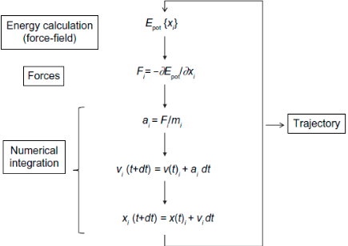

should you read this:

1.  Kleinjung J, Fraternali F. Design and application of implicit solvent models in biomolecular simulations. Curr Opin Struct Biol. 2014;25:126–134. [*](https://www.ncbi.nlm.nih.gov/pmc/articles/PMC4045398/)

berikut adalah algoritma dasar Dinamika Molekul

singkatan: Epot, potential energy; t, simulation time; dt, iteration time; For each spatial coordinate of the N simulated atoms (i): x, atom coordinate; F, forces component; a, acceleration; m, atom mass; v, velocity.