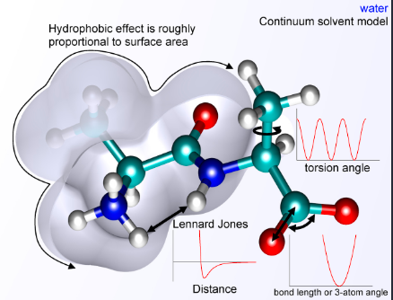

medan gaya adalah metode komputasi yang digunakan untuk memperkirakan gaya antara atom dalam molekul dan juga antara molekul (intramolekul dan intermolekul)

medan gaya adalah potensial antara atom dan menggunakana konsep yang sama dengan medan gaya dalam fisikla klasik, dengan perbedaan bahwa parameter medan gaya dalam kimia meneggambarkan lanskap energi, dari mana gaya yang bekerja pada setiap partikel diturunkan sebagai grafien energi potensial terhadap koordinat partikel. 

bentuk umum untuk energi total dalam medan gaya aditif dapat dituliskan sebagai 
Etotal = Ebonded + Enonbonded

