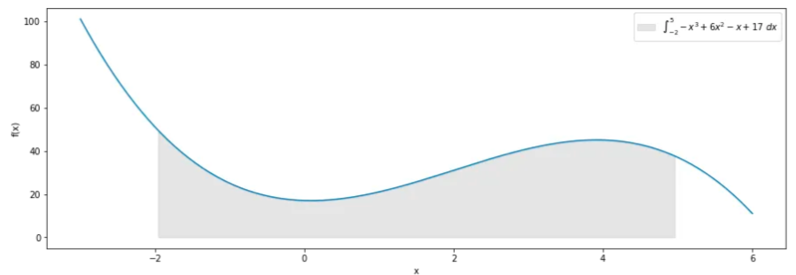

integral dapat digunakan dalam menghitung luas dibawah sebuah fungsi misalnya untuk fungsi -x3 + 6x2 - x + 17 dengan batas bawah adalah -2 dan batas atas adalah 5, sehingga didapatkan ilustrasi sebagai berikut. 

maka luas tersebut dapat dihitung dengan menyelesaikan integral. metode monte carlo juga dapat digunakan untuk mencari luas dibawah fungsi tersebut yaitu dengan merata-ratakan luas persegi yang divariasikan tinggi persegi sesuai dengan fungsi. secara intuisi semakin banyak variasi yang dihitung, maka akan semakin akurat bukan?

reference[*](https://towardsdatascience.com/the-basics-of-monte-carlo-integration-5fe16b40482d)