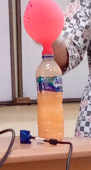

Nasi mengandung karbohidrat dan air (Poedjiadi, 2007). dapat dicerna menjadi glukosa. MOL adalah mikroorganisme lokal. akan meningkatkan unsur kandungan hara dalam tanah. 

kandungan pada zat nasi basi

>N 0,7%
>P2O5 0,4%
>S
>C
>P
>dst. 

diamkan hingga muncul jamur rhizopys oligosporus, bewarna kuning (itu tumbuh ketika nasi basi 3-5 hari tanpa sinar matahari). aduk dan tambahkan air dan tambahakan gula. tutup dengan balon, biarkan selama 5-7 hari, maka balon akan mengandung gas, diamkan sampai balon mengempes, lalu tutup botol. 

canpurkan MOL dnegna air dengan komposisi 1:5 liter. jika tidak digunakan MOL dapat disimpan selaam 5 - 6 bulan, usahakan dalam keadaan tertutup dan tempat gelap, kalau ditempatkan di bawah sinar matahari mikroorganismenya bisa mati. 

memperbaiki struktur tanah dan menambah unsur hara.

alasan bau adalah kalau tertutup tidak ada oksigen, maka terjadi proses anaerob, 

dalam beras mengandung unsur2 diatas aerop menghasilkan NO2, kalau **anaerob** akan menghasilkan NH3 (NH3 bau). kalau pada C aerob akan menghasilkan CO2 kalau anaerob menghasilkan CH3. kalau pada S aerob akan menghasilkan SO2, kalau anaerob menghasilkan H2S (H2S ini sangat berbau). *anaerob adalah ketika tidak ada oksigen*.

gula yang ditambahkan juga untuk memberimakan mikroorganisme (jamur). kalau terlalu lama bakterinya akan mati karena gulanya sudah habis, setelah itu dia akan menjadi pupuk (tidak mengandung mikroorganisme) mengandung unsur-unsur hara yang diperlukan. 

kalau jamur bewarna hitam, artinya bukan lagi rhizopus lagi. biasanya jamur bewarna hitam itu adalah lebih jahat. kalau ditempatkan pada lingkungan yang kotor jamur yang tumbuh mungkin akan lain juga. atau misalnya nasi yang bercampur dengan lemak mungkin jamur yang tumbuh juga akan berbeda.  

ledakan fermentasi itu kuat. gas yang timbul adalah gas tergantung dari bahan dasarnya, misalnya dari nasi adalah NH3 atau H2S atau CO2. 

kalau ini gasnya tidak disalurkan lewat air, tetapi ditampung dalam balon udara, kemudian sesekali dikempeskan agar gas dalam balon tersebut tidak bereaksi dalam MOL. 